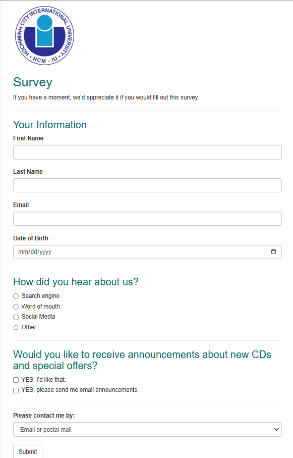
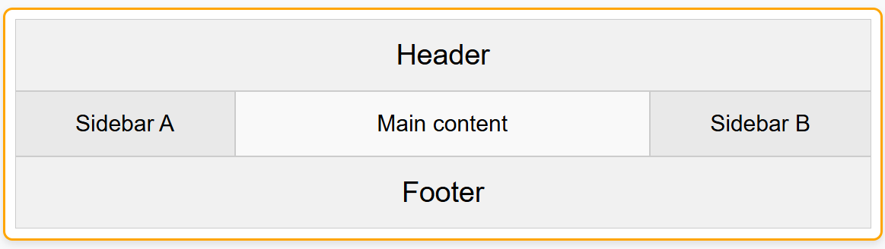
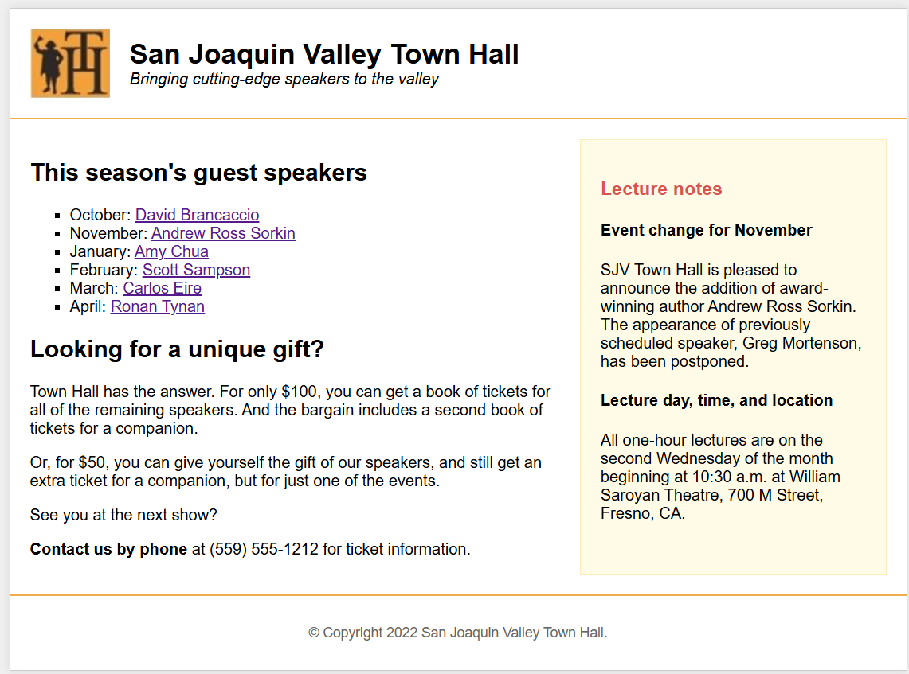

Web Application Development - Lab 4 Report

Course: Web Application Development Lab (ITCSIU23014)
Instructor: Assoc. Prof. Nguyen Van Sinh & MSc. Nguyen Trung Nghia
Student Name: [Nguyen Tan Khanh]
Student ID: [ITCSIU23014]

I. Introduction

This report details the completion of exercises for Lab 4, focusing on advanced HTML forms, CSS Flexbox layouts, and website deployment using GitHub Pages. The objective was to apply these concepts to build and publish structured web pages.

II. Exercises

Exercise 1: Deploy Personal Web Page (15 pts)

Objective: To deploy the personal website created in a previous lab to a live URL using GitHub Pages.

Deployment Link:

https://banhkheo.github.io/ITCSIU23014_NguyenTanKhanh/

Exercise 2: Survey Form Creation (30 pts)

Objective: To create a survey form using various HTML input elements as specified in the lab sheet.

Result (Screenshot):

Exercise 3: 3-Column Flexbox Layout (20 pts)

Objective: To implement a three-column, fixed-width layout using CSS Flexbox.

Result (Screenshot):

    Code: 
        

            
Header

            
            <!-- This container now holds the side-by-side elements -->
            

                
Sidebar A

                
Main content

                
Sidebar B

            

        
            
Footer

        

    Explaination: This is html backbone. The container display flex and in column apply into 3 div. And the div with class content-wrapper display flex and in row. And using flex-flow to display the size of element in row of the content-wrapper
    

Exercise 4: San Joaquin Valley Town Hall Page (35 pts)

Objective: To implement a complete webpage layout using HTML, CSS, and Flexbox based on the provided design.

Result (Screenshot):

Explaination:
    The HTML backbone for this page is the .page-container, which holds the <header>, <main>, and <footer> sections.

    The two-column layout is created by making the <main class="main-content-area"> a flex container using display: flex;. This automatically places its direct children, the .main-column and .sidebar-column, side-by-side in a row.

    The flex property is then used to control the width of these columns. By setting flex: 2 on the .main-column and flex: 1 on the .sidebar-column, the main content takes up roughly two-thirds of the space, and the sidebar takes up the remaining one-third.

III. Homework

Objective: To implement the final webpage using a three-column Flexbox layout as described in the lab sheet.

Result (Screenshot):

Source Code (HTML & CSS):

<!-- Paste Your HTML & CSS Code for the Homework Here -->

IV. Conclusion

This lab provided practical experience in structuring complex web layouts with CSS Flexbox, creating detailed HTML forms, and deploying static websites. The exercises successfully demonstrated the ability to translate design mockups into functional, well-structured code and publish it online.