# 🚀 LAB 3 
# Task 1.1: Interactive Form Validator (15 Points)

> ✨ A real-time **interactive form validator** built with HTML, CSS, and JavaScript.  
> It validates user input before submission — similar to real-world signup forms used on websites like Facebook or Gmail.

## Results

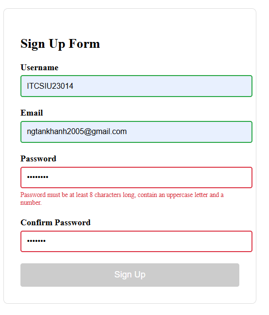
## 🧠 JavaScript Logic

### ShowError
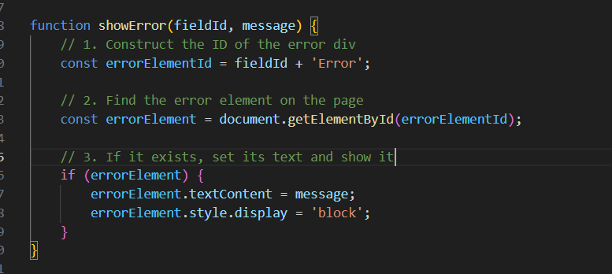

- Field_id is the name of input field + string 'Error', we can find the hidden div with 'FieldId' + 'Error' and visble is to the page 
- Add the msg to the div because it empty

### Border the input
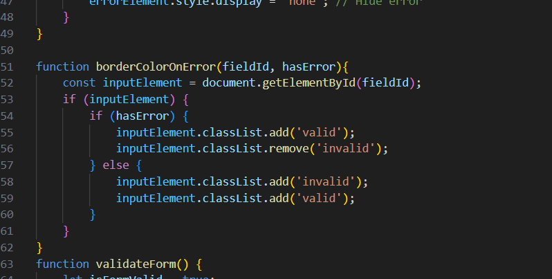
- This is using in the validate Form method if user input wrong add the class 'invalid' and remove 'valid' to the input tag, in constrast add the class'valid' and remove 'invalid'

# Task 1.2: Interactive Form Validator (15 Points)

## Results

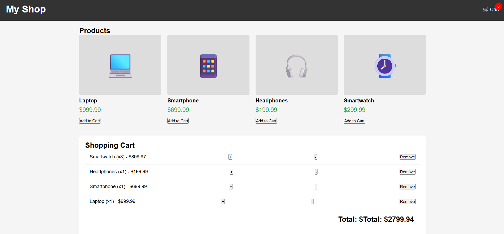
## 🧠 JavaScript Logic

### Render Product 
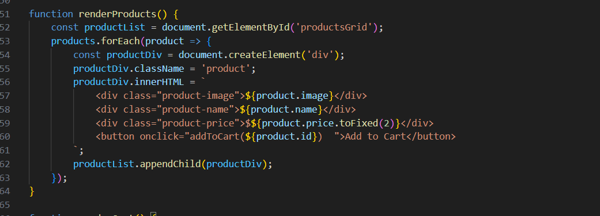

- Loop through product object array to render all product with div include picture, name, price, and button add to cart
- And render at beginning of the web

### Toggle the cart

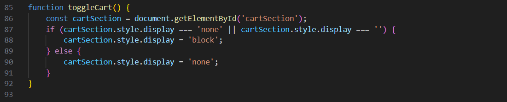

- Onclick on the cart icon and open the div cart is hidding and click again to hide

### Add to cart

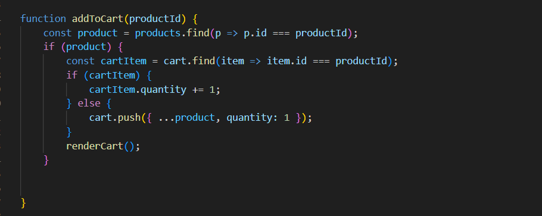

- If the product already in the cart increase the cart quantity by 1
- If not add product to the cart

### Render the cart
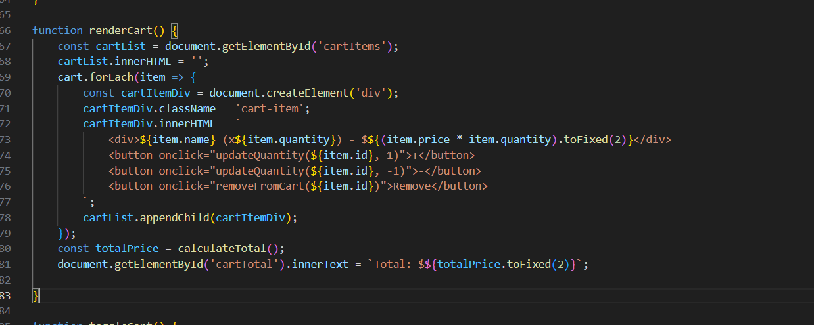

- if cart has item create the div item content quantity, plus, subtract button and totals prices

# Task 2.1: Weather Dashboard (15 points)

🎯 Real-World Application
Weather apps on your phone, weather widgets on news sites, smart home displays - they all fetch real-time data from weather APIs. Companies like The Weather Channel and AccuWeather serve billions of API requests daily. In this task, you'll build a professional weather dashboard that fetches real data from a weather API.

## Results

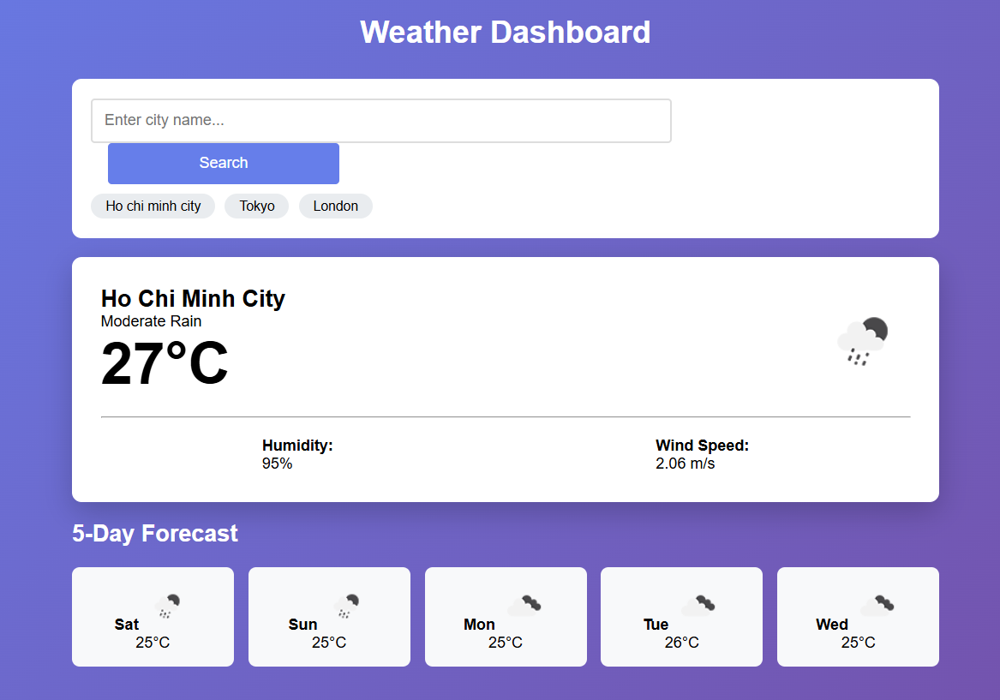
## 🧠 JavaScript Logic

### Search Weather 
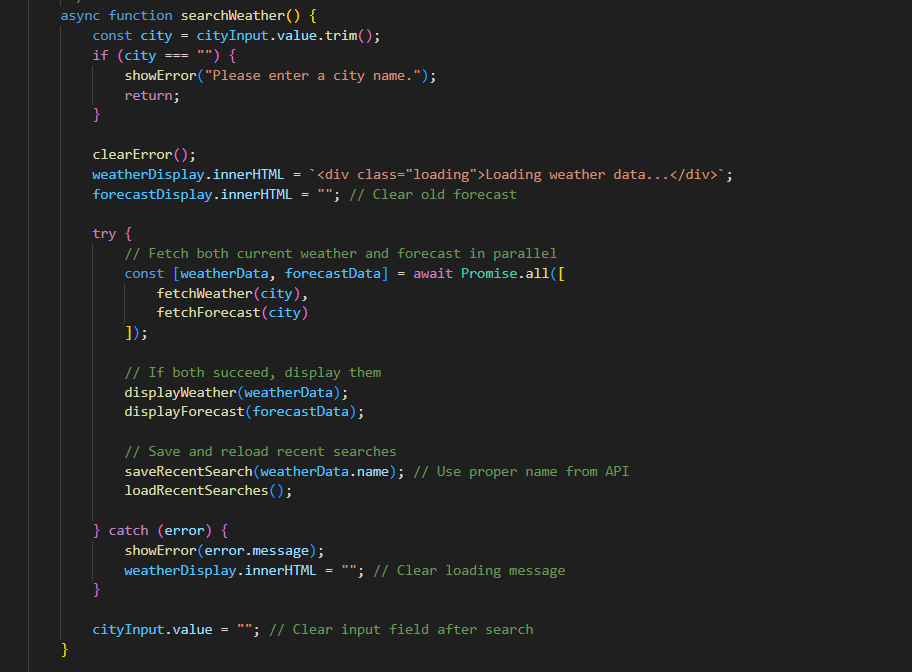
- Handle when user click enter or right click on the search button whehter the name of city correct or not then present the error
- If city is valid simultaneously call api of forecast and weather in paralel

### Fetch Weather and Fetch Forecast
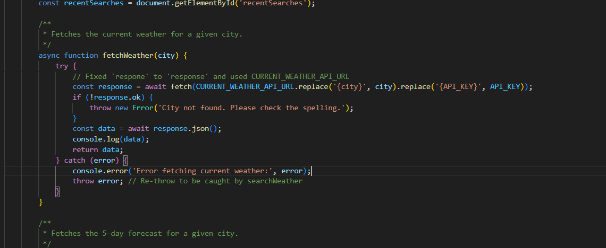
- Call api and receive data in the envelope under name response so we need transform response to json file with this format

### Display Weather and Forecase 

- When we get the data add the data into the html structure by using innerHTML

### Save & Load Recent Search 

- store my recent in json format name recentSearches and store in the user hard drive when browrse need to retrived data come to that place 

# Task 2.2: GitHub Repository Finder (15 points)

🎯 Real-World Application
Developer tools, code review platforms, and portfolio sites all integrate with GitHub's API to display repository information. Sites like GitExplorer, GitHub trending pages, and developer portfolios use the GitHub API to showcase projects.

## Results
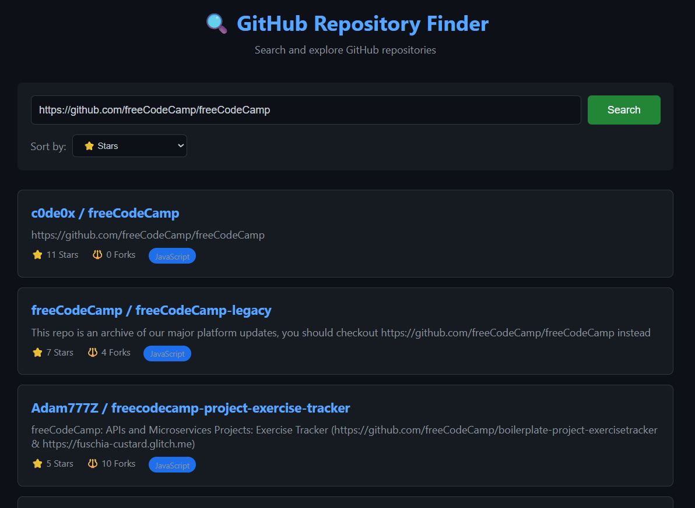

### Perform Search
- The same to exercise 2.1, handle when user click enter or right click on the search button whehter the name of city correct or not then present the error
- Then call api of github repository return data

### Display Repo
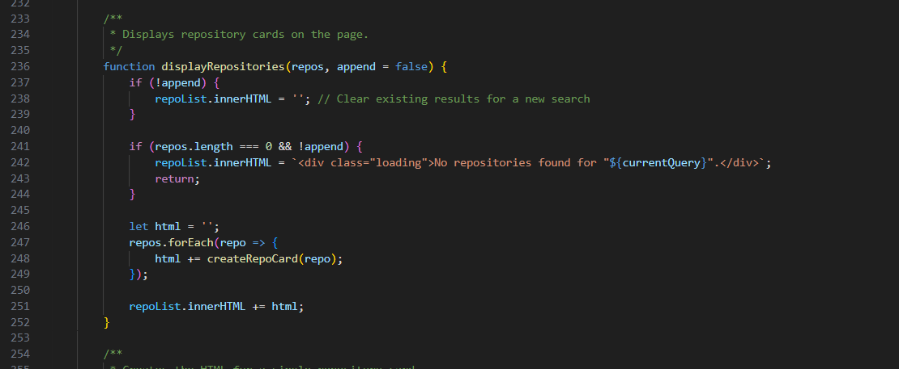

- The append parameter is a boolean flag (true/false) that tells the function whether to replace the results on the page or add to them.

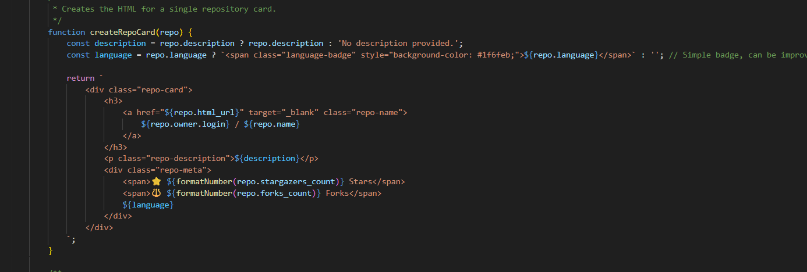

- Add repo card

### Load More

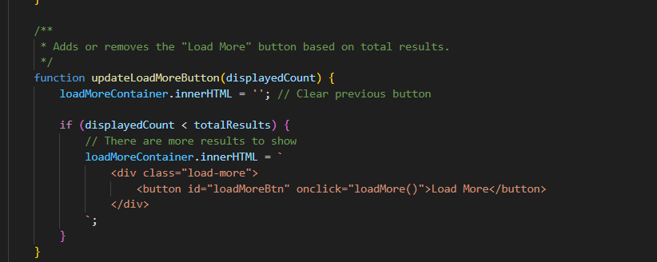
- If the display count lower than total results add the html of load more button
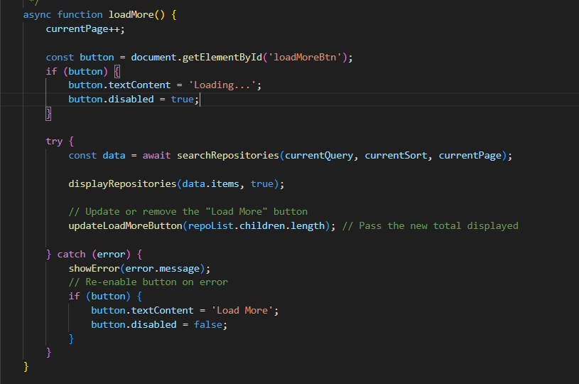
- One click on load more button has just added to load more repo

