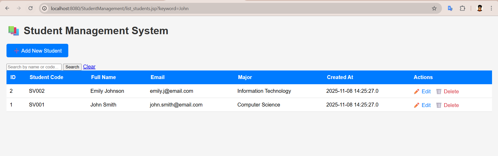
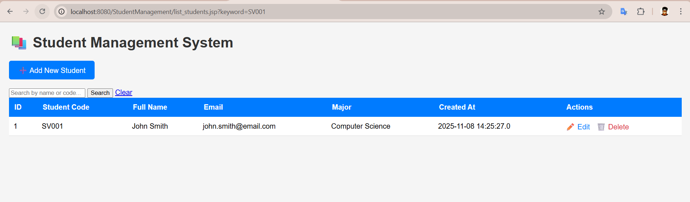
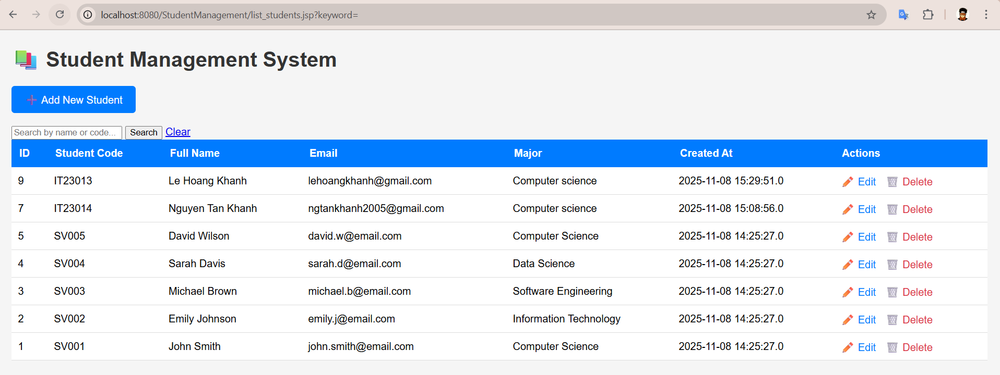
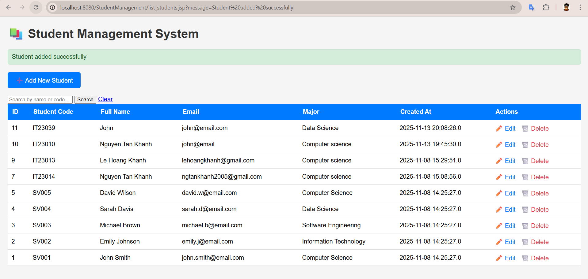
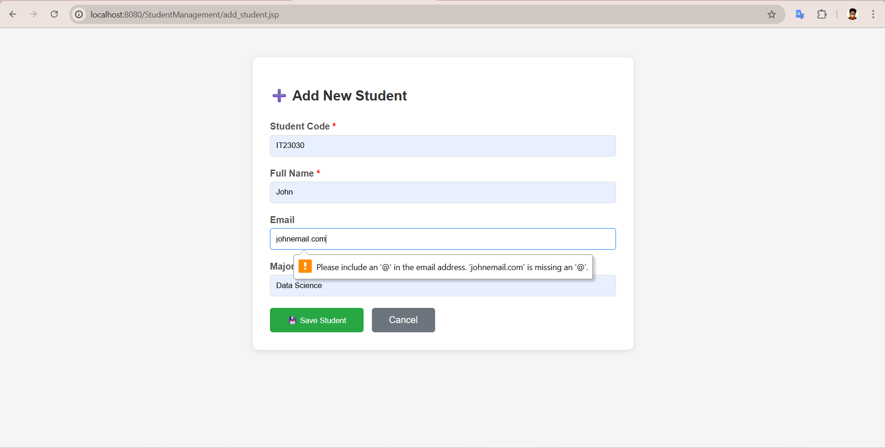
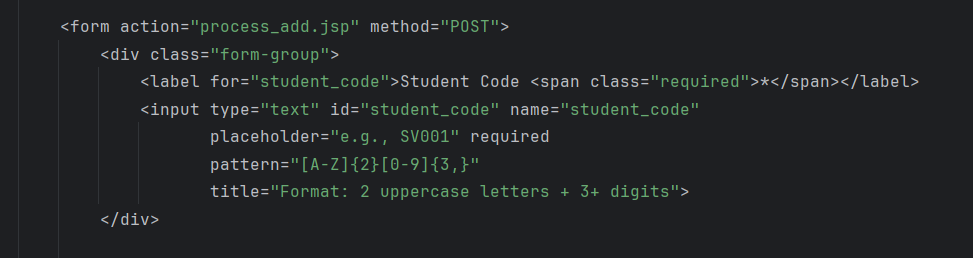
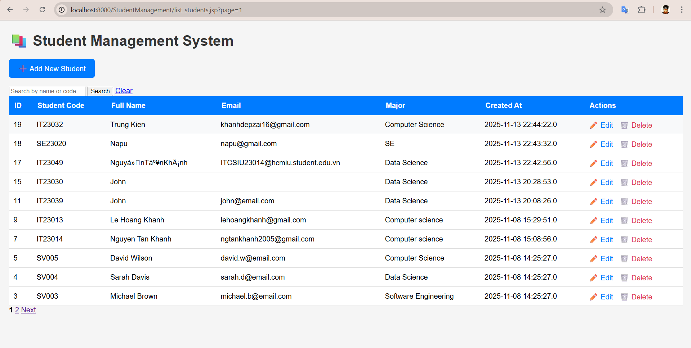
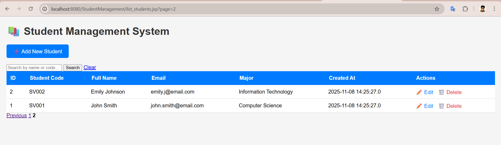
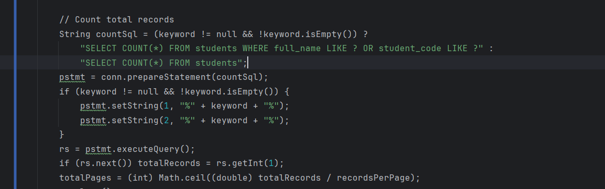
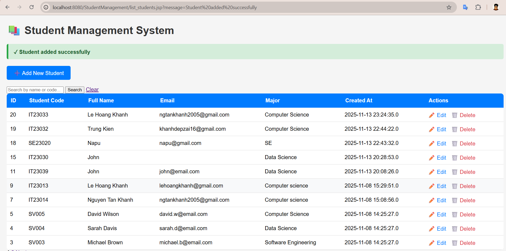

# 🚀 LAB 4 EXERCISES: JSP + MYSQL - CRUD OPERATIONS
> Course: Web Application Development
> Name: Nguyen Tan Khanh
> ID: ITCSIU23014
> Tutor: Nguyen Trung Nghia

# PART A: IN-CLASS EXERCISES (60 points)

## EXERCISE 1: SETUP AND DISPLAY (15 points)
### Task 1.1: Project Setup 


### Task 1.2: Display Student List (10 points)


## EXERCISE 2: CREATE OPERATION (15 points)

### Task 2.1: Create Add Student Form (5 points)

> ✨ When click on the add button it link to the add_student.jsp


### Task 2.2: Process Add Student (10 points)

> When click on submit button it will execute the process_add.jsp and process_add file only has java code, therefore it not display
> All the error of user input will be handle in process_add.jsp and present on the add_student.jsp
> Then successfull go to the list_student page


## EXERCISE 3: UPDATE OPERATION (15 points)

### Task 3.1: Create Edit Form (7 points)


> Click on update button action edit_student is call move to that jsp file with form already load data from database
> Then edit 
### Task 3.2: Process Update (8 points)
> The same to add_process

## EXERCISE 4: DELETE OPERATION (15 points)

### Task 4.1: Implement Delete (10 points)


# PART B: HOMEWORK EXERCISES (40 points)

## EXERCISE 5: SEARCH FUNCTIONALITY (15 points)

> Search John

> Search Code

> Search Normal


### Code modification
```
Connection conn = null;
    PreparedStatement pstmt = null; // Use PreparedStatement, not Statement
    ResultSet rs = null;
    String sql = "";
String keyword = request.getParameter("keyword");

        if (keyword != null && !keyword.isEmpty()) {
            // Search query with LIKE operator
            sql = "SELECT * FROM students WHERE full_name LIKE ? OR student_code LIKE ? ORDER BY id DESC";
            pstmt = conn.prepareStatement(sql);
            pstmt.setString(1, "%" + keyword + "%"); // Set parameters safely
            pstmt.setString(2, "%" + keyword + "%");
        } else {
            // Normal query
            sql = "SELECT * FROM students ORDER BY id DESC";
            pstmt = conn.prepareStatement(sql);
        }

        rs = pstmt.executeQuery(); // Execute the *prepared* statement
```
> Declare new string sql for reuse 
> PreparedStatement for statement with the parameter

## EXERCISE 6: VALIDATION ENHANCEMENT (10 points)

### 6.1: Email Validation (5 points)
>Valid John email


>Invalid John email

### 6.2: Student Code Pattern Validation (5 points)
> Already implement in the code


## EXERCISE 7: USER EXPERIENCE IMPROVEMENTS (15 points)

### 7.1: Pagination (8 points)

> Result 




> Query the database to find all record apply for select all and select specific user input
> Count the number of page


> In SQL (and pagination), the keyword OFFSET means “skip this many rows before starting to return results.”
> To query correct row data using formular [ int offset = (currentPage - 1) * recordsPerPage; ]  

```
    <div class="pagination">
        <% if (currentPage > 1) { %>
            <a href="list_students.jsp?page=<%= currentPage - 1 %>">Previous</a>
        <% } %>

        <% for (int i = 1; i <= totalPages; i++) { %>
            <% if (i == currentPage) { %>
                <strong><%= i %></strong>
            <% } else { %>
                <a href="list_students.jsp?page=<%= i %>"><%= i %></a>
            <% } %>
        <% } %>

        <% if (currentPage < totalPages) { %>
            <a href="list_students.jsp?page=<%= currentPage + 1 %>">Next</a>
        <% } %>
    </div>
```
> String pageParam = request.getParameter("page"); This line of code will return the current page of the pagination
> list_students.jsp?page=2 will return 2 for example

### 7.2: Improved UI/UX (7 points)

>Add tick on respone and response disappear in 3000 ms


> Add loading states "Processing" when click search button

> Add table scrollable on small screens

