# 🚀 LAB 5 EXERCISES: SERVLET & MVC PATTERN
Course: Web Application Development
Name: Nguyen Tan Khanh
ID: ITCSIU23014
Tutor: Nguyen Trung Nghia

# PART A: IN-CLASS EXERCISES (60 points)

## Project Structure (5 points)
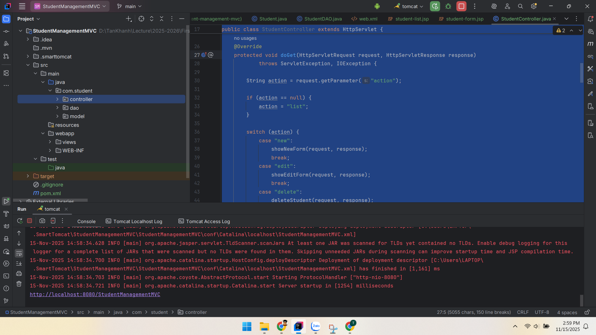

## Test DAO
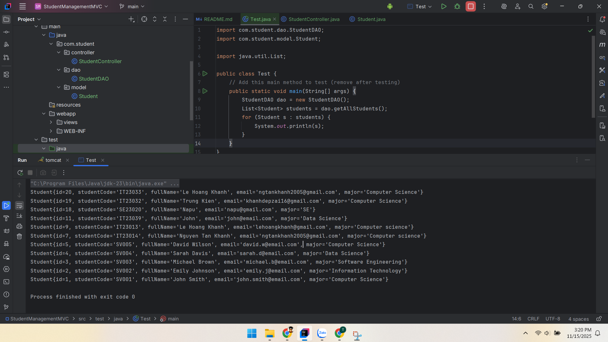

## Test Sequence

### List: Navigate to /student - should see existing students
## Student Display
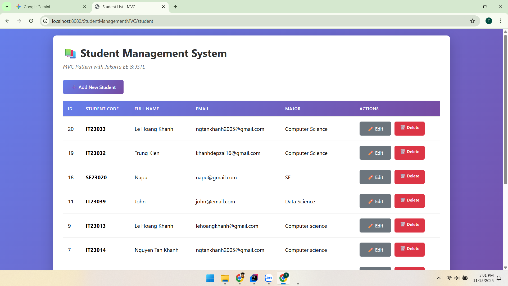
```
@Override
    protected void doGet(HttpServletRequest request, HttpServletResponse response)
            throws ServletException, IOException {

        String action = request.getParameter("action");

        if (action == null) {
            action = "list";
        }

        switch (action) {
            case "new":
                showNewForm(request, response);
                break;
            case "edit":
                showEditForm(request, response);
                break;
            case "delete":
                deleteStudent(request, response);
                break;
            default:
                listStudents(request, response);
                break;
        }
    }

```
> When browser point to server link, it sends the get request
> with no input the action defaults is list 
> ,then it call the listStudents function.
```
private void listStudents(HttpServletRequest request, HttpServletResponse response)
            throws ServletException, IOException {

    List<Student> students = studentDAO.getAllStudents();
    request.setAttribute("students", students);

    RequestDispatcher dispatcher = request.getRequestDispatcher("/views/student-list.jsp");
    dispatcher.forward(request, response);
}
```
- listStudent is the handshake between Controller and View 
- request.setAttribute like a backpack attaching data to the current HTTP Request object
- You are creating a "navigator" object. You are telling the server: "I want to go to the file located at /views/student-list.jsp

### Add: Click "Add New Student"
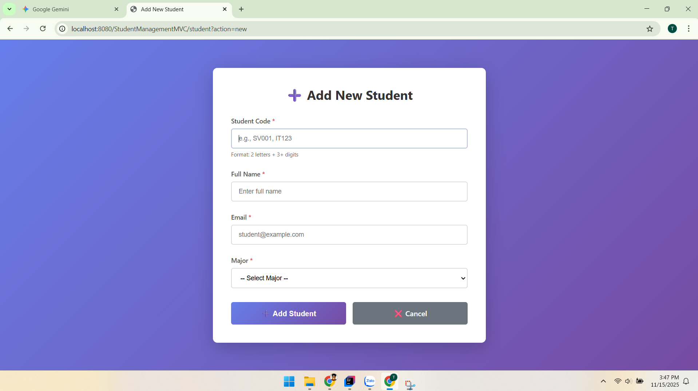

```
<div style="margin-bottom: 20px;">
    <a href="student?action=new" class="btn btn-primary">
        ➕ Add New Student
    </a>
</div>
```
- When click on add a tag it will call get method attach action = add 
- when action = add it call function showNewForm and request to access student-form.jsp
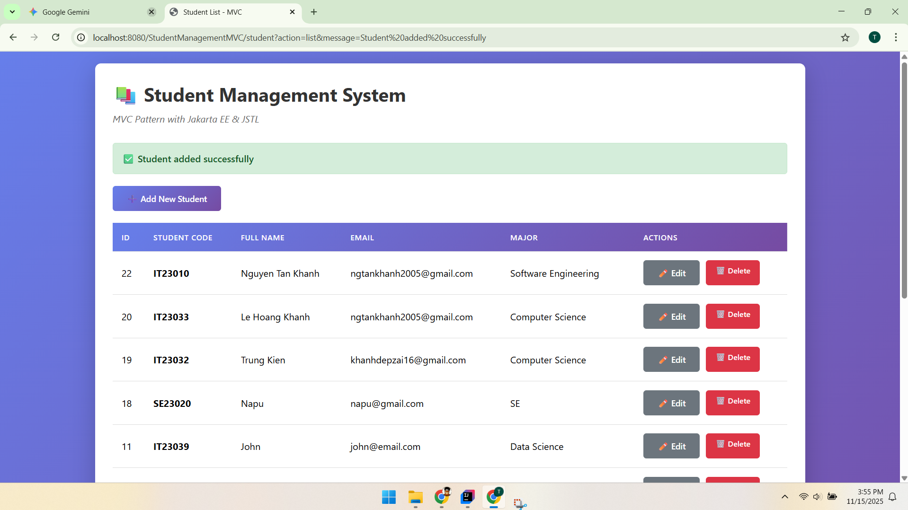
```
 <form action="student" method="POST">
    <!-- Hidden field for action -->
    <input type="hidden" name="action"
           value="${student != null ? 'update' : 'insert'}">

    <!-- Hidden field for ID (only for update) -->
    <c:if test="${student != null}">
        <input type="hidden" name="id" value="${student.id}">
    </c:if>
```
- When submit the form it call method post in StudentController
- If student = null set the action to insert
- Action insert in doPost call function 
```
private void insertStudent(HttpServletRequest request, HttpServletResponse response)
            throws IOException {

    String studentCode = request.getParameter("studentCode");
    String fullName = request.getParameter("fullName");
    String email = request.getParameter("email");
    String major = request.getParameter("major");

    Student newStudent = new Student(studentCode, fullName, email, major);

    if (studentDAO.addStudent(newStudent)) {
        response.sendRedirect("student?action=list&message=Student added successfully");
    } else {
        response.sendRedirect("student?action=list&error=Failed to add student");
    }
}
```
- Go to DAO and connect with database and insert the new student in the DB
- Then reDirect the link and do the list task above call get method again. If false with fail msg if true successfully msg

### Edit: Click "Edit" on test student
- The same with explanation in add
### Delete 
- The same with explanation in add

# PART B: HOMEWORK EXERCISES (40 points)
## EXERCISE 5: SEARCH FUNCTIONALITY


```
// Controller: searchStudents method
private void searchStudents(HttpServletRequest request, HttpServletResponse response)
throws ServletException, IOException {
String keyword = request.getParameter("keyword");
// ... logic to handle null keyword ...
List<Student> students = studentDAO.searchStudents(keyword);
request.setAttribute("students", students);
request.setAttribute("keyword", keyword); // Preserve input
RequestDispatcher dispatcher = request.getRequestDispatcher("/views/student-list.jsp");
dispatcher.forward(request, response);
}

// DAO: SQL Query
String sql = "SELECT * FROM students WHERE student_code LIKE ? OR full_name LIKE ? OR email LIKE ? ORDER BY id DESC";
```

- Controller: Receives the keyword from the search bar.

- DAO: Uses LIKE %?% in SQL to check Student Code, Name, or Email.

Forward: Sends both the result list (students) and the search term (keyword) back to the JSP to keep the input box filled.

Search UI & Testing
```
<form action="student" method="GET">
    <input type="hidden" name="action" value="search">
    <input type="text" name="keyword" value="${keyword}" placeholder="Search...">
    <button type="submit">🔍 Search</button>
</form>
```

- Form: Uses GET method so the URL becomes bookmarkable (e.g., student?action=search&keyword=John).

- Preservation: value="${keyword}" ensures the text doesn't disappear after clicking search.

### Results

- Search Test
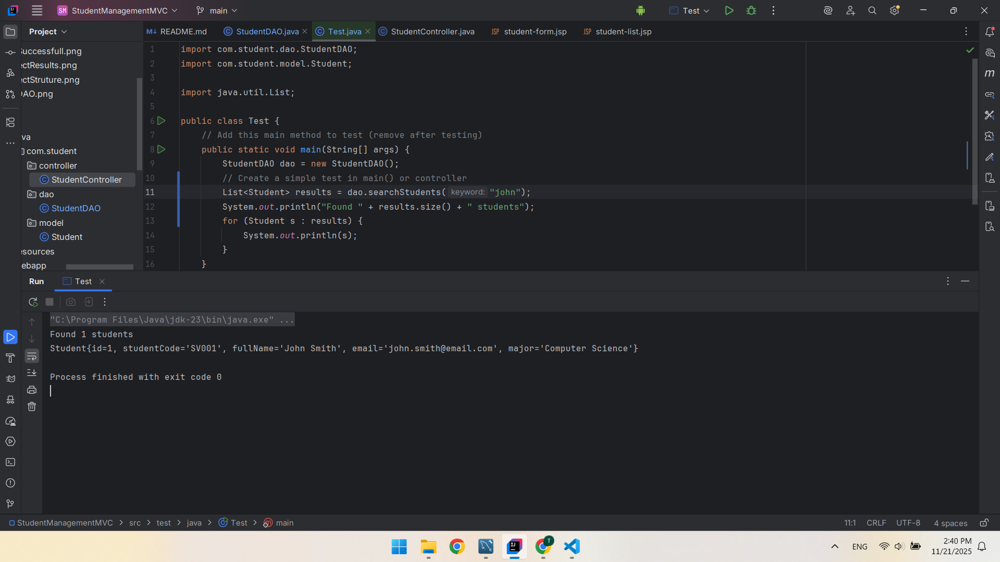
- Search Name
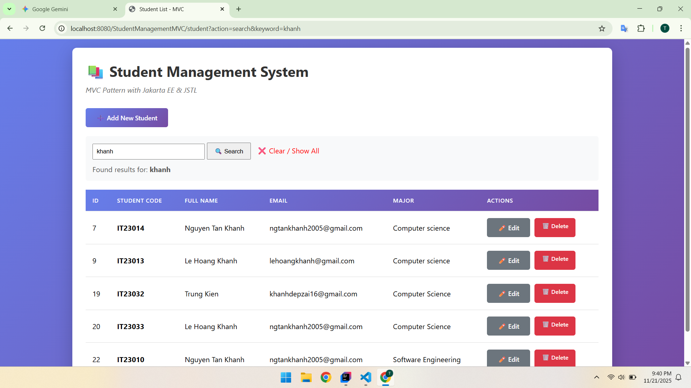
- Search Code
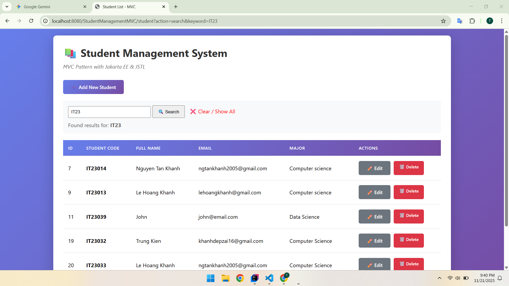


## EXERCISE 6: SERVER-SIDE VALIDATION

### Validate Add

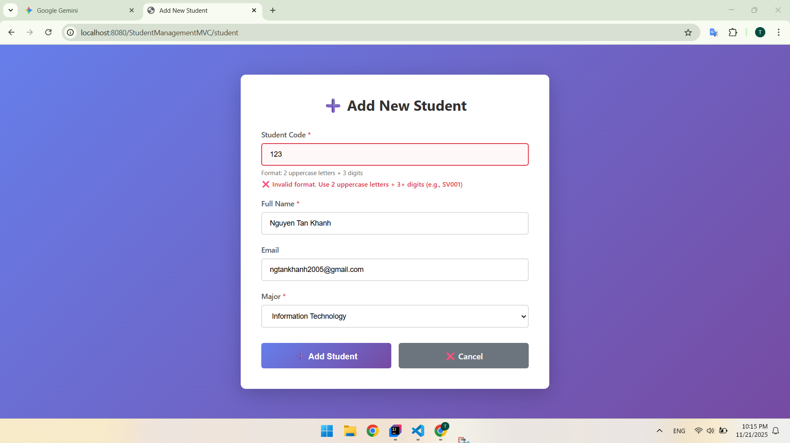

### Validate Edit

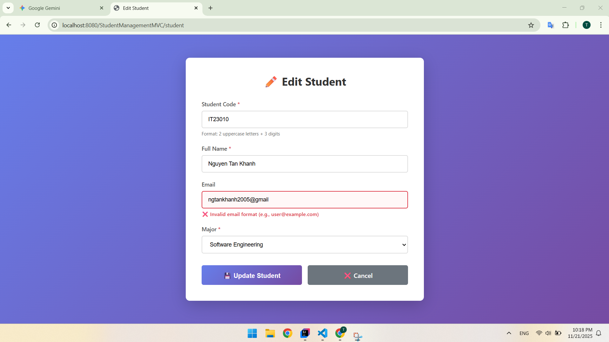


## EXERCISE 7: SORTING & FILTERING

### Combined Universal Logic
```
// DAO: getStudentsUniversal
public List<Student> getStudentsUniversal(String keyword, String major, String sortBy, String order) {
StringBuilder sql = new StringBuilder("SELECT * FROM students WHERE 1=1");
// Append AND major = ? if major is selected
// Append LIKE ? if keyword exists
// Append ORDER BY if sortBy exists
}
```

- Unified Method: Instead of separate methods for Search, Sort, and Filter, this "Universal" method builds dynamic SQL.

- Flexibility: Allows searching for "John" inside the "Computer Science" major while sorted by "ID".

Filter by Major

```
<select name="major" onchange="this.form.submit()">
    <option value="Computer Science" ${selectedMajor == 'Computer Science' ? 'selected' : ''}>
        Computer Science
    </option>
    ...
</select>
```

- Dropdown: Submits the form immediately on change.

- State: The Controller sends back selectedMajor to keep the dropdown set to the user's choice.

### Sorting Implementation
- (Sorting by ID - Default View)

- (Sorting by Student Code)
```
<th>
    <a href="student?action=sort&sortBy=student_code&order=${sortBy == 'student_code' && order == 'asc' ? 'desc' : 'asc'}">
        Code ${sortBy == 'student_code' ? (order == 'asc' ? '▲' : '▼') : ''}
    </a>
</th>
```

### Results 
- Sort By Id
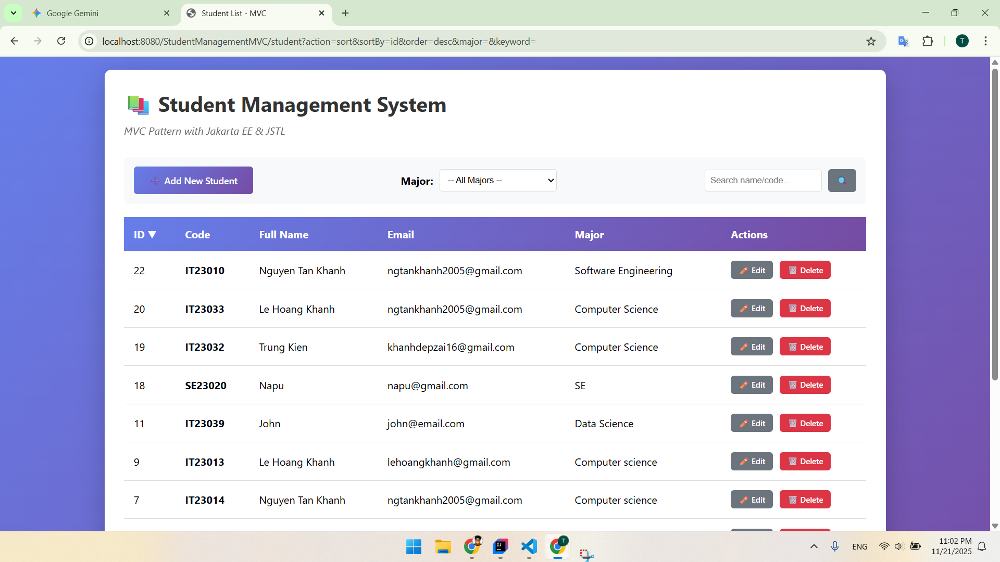
- Sort By Code
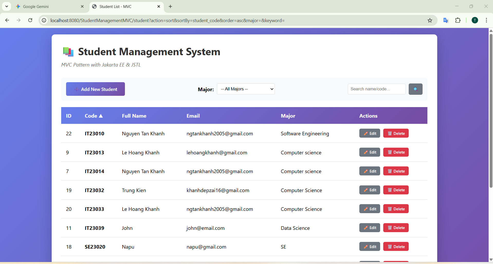
- Filter By Major
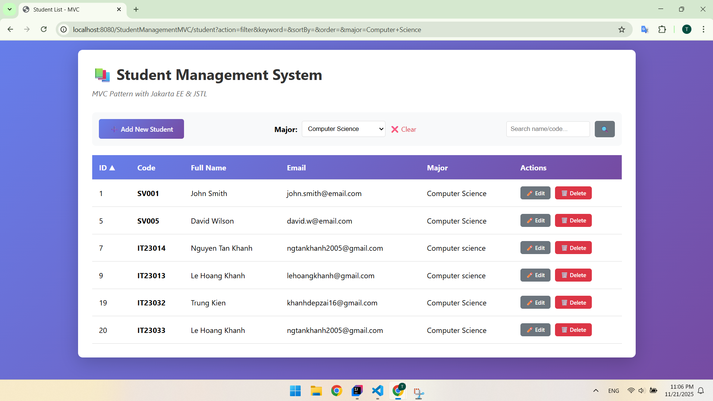
- Combine Filter By Major And Sort  
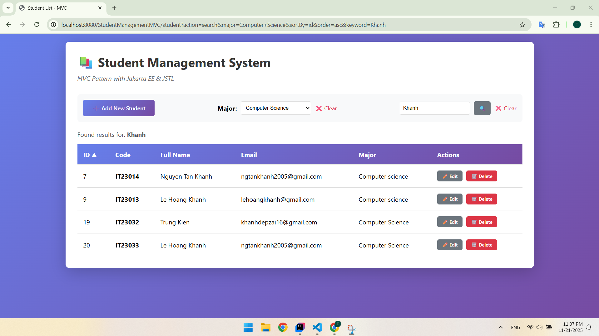


