# 🚀 LAB 6 EXERCISES: AUTHENTICATION & SESSION MANAGEMENT
Course: Web Application Development
Name: Nguyen Tan Khanh
ID: ITCSIU23014
Tutor: Nguyen Trung Nghia

# PART A: IN-CLASS EXERCISES (60 points)

## Project Structure (5 points)
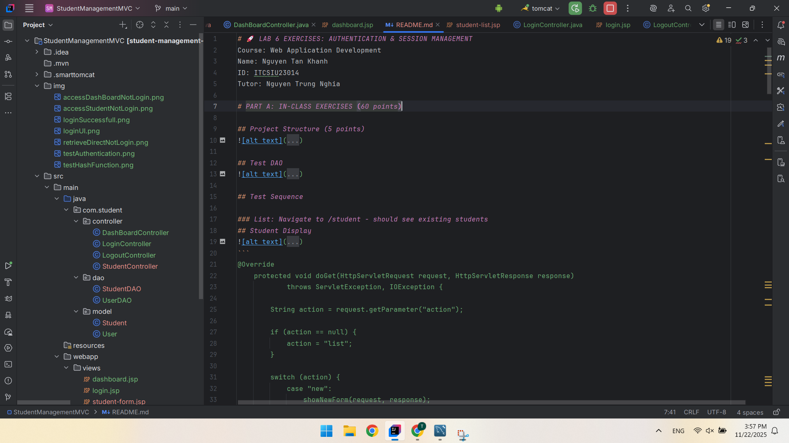

## EXERCISE 1: DATABASE & USER MODEL (15 points)

### Test Hash Function
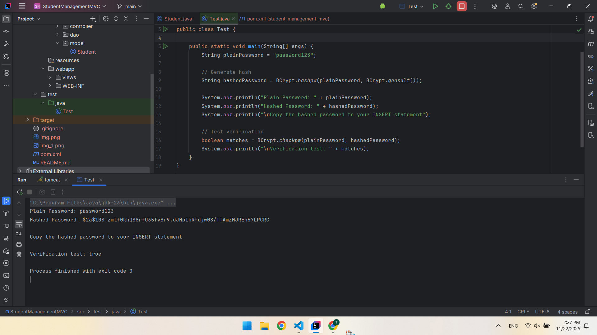

## EXERCISE 2: USER MODEL & DAO (15 points)
### Authentication core method
```
private static final String SQL_AUTHENTICATE =
            "SELECT * FROM users WHERE username = ? AND is_active = 1";
public User authenticate(String username, String password) {
    try (Connection conn = getConnection();
         // Use the CONSTANT defined at the top
         PreparedStatement pstmt = conn.prepareStatement(SQL_AUTHENTICATE)) {

        pstmt.setString(1, username);

        try (ResultSet rs = pstmt.executeQuery()) {
            if (rs.next()) {
                // 1. Get the hashed password from DB
                String storedHash = rs.getString("password");

                // 2. Check password using BCrypt
                if (BCrypt.checkpw(password, storedHash)) {

                    // 3. Use Helper method to create User object
                    User user = mapResultSetToUser(rs);

                    // Security: Clear the password hash before returning to Controller/View
                    user.setPassword(null);

                    // 4. Update last login
                    updateLastLogin(user.getId());

                    return user;
                }
            }
        }
    } catch (SQLException e) {
        e.printStackTrace();
    }
    return null; // Login failed
}
```
- Access table user in database retrieve the user with username
- Using the Bcrypt library to check password and the hash password store in database is that correct or not 
- Then store all attribute of the row to user object

### Authentication Test
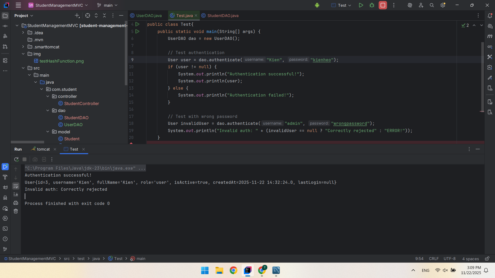


## EXERCISE 3: LOGIN/LOGOUT CONTROLLERS (15 points)
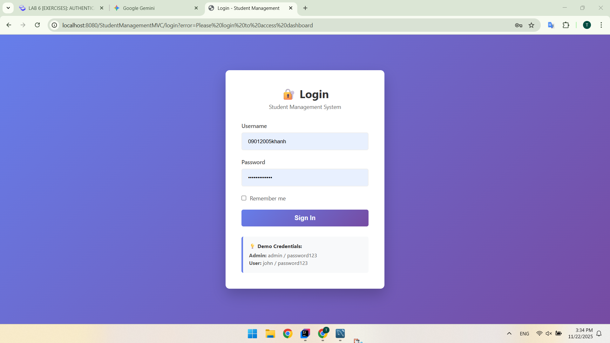

### Retrive DashBoard and Student List without login
- http://localhost:8080/StudentManagementMVC/dashboard
```
// 1. Get user from session
HttpSession session = request.getSession(false);
User user = (session != null) ? (User) session.getAttribute("user") : null;

// Security Check: If not logged in, redirect to login
if (user == null) {
    response.sendRedirect("login?error=Session expired, please login again");
    return;
}

// 2. Get statistics (Total Students)
// Ensure your StudentDAO has the getTotalStudents() method!
int totalStudents = studentDAO.getTotalStudents();

// 3. Set attributes
request.setAttribute("totalStudents", totalStudents);

// 4. Forward to dashboard.jsp
request.getRequestDispatcher("/views/dashboard.jsp").forward(request, response);
```
- This code using to check is there any section has already generate if not require user to login 
- If already login move to the dashboard page
### Login Successfull
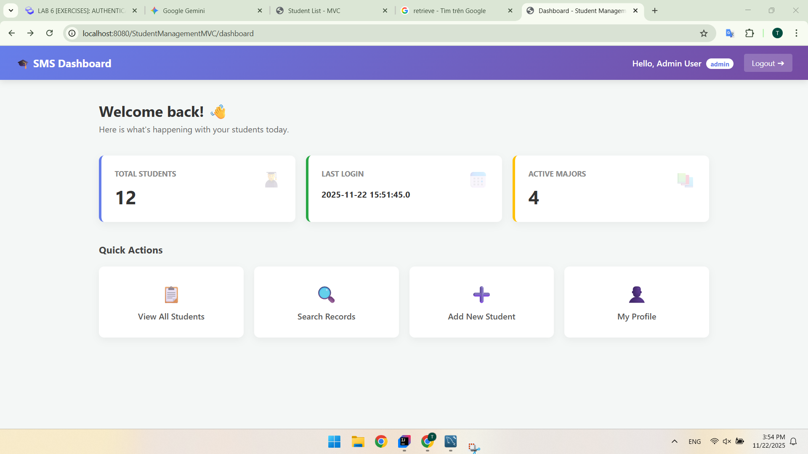

# PART B: HOMEWORK EXERCISES (40 points)

## EXERCISE 5: AUTHENTICATION FILTER (12 points)

### Code Explanation

```
public void doFilter(ServletRequest request, ServletResponse response, FilterChain chain)
        throws IOException, ServletException {

    // 1. Cast to HTTP objects to access Session and URL data
    HttpServletRequest httpRequest = (HttpServletRequest) request;
    HttpServletResponse httpResponse = (HttpServletResponse) response;

    // 2. Extract the specific path requested (e.g., "/dashboard" or "/login")
    // RequestURI = "/StudentManagement/dashboard"
    // ContextPath = "/StudentManagement"
    // Path = "/dashboard"
    String requestURI = httpRequest.getRequestURI();
    String contextPath = httpRequest.getContextPath();
    String path = requestURI.substring(contextPath.length());

    // 3. Check if this is a Public URL
    if (isPublicUrl(path)) {
        // It's public, let them pass without checking session
        chain.doFilter(request, response);
        return;
    }

    // 4. Check if user is logged in
    // getSession(false) means: Get current session, but DO NOT create a new one if none exists.
    HttpSession session = httpRequest.getSession(false);
    boolean isLoggedIn = (session != null && session.getAttribute("user") != null);

    if (isLoggedIn) {
        // 5. User is valid, allow request to proceed to Controller/JSP

        // (Optional) Prevent browser back-button caching of secured pages
        httpResponse.setHeader("Cache-Control", "no-cache, no-store, must-revalidate"); // HTTP 1.1
        httpResponse.setHeader("Pragma", "no-cache"); // HTTP 1.0
        httpResponse.setDateHeader("Expires", 0); // Proxies

        chain.doFilter(request, response);
    } else {
        // 6. User is NOT logged in, kick them to the login page
        // We use sendRedirect because we want the URL to change
        System.out.println("⛔ Access Denied for path: " + path);
        httpResponse.sendRedirect(contextPath + "/login?error=Please login first");
    }
}
```
- Check if the endpoints is in the public user dont need to check session
- Else check the object session has already generated or not if not require login else redirection to login page with error msg


### Access endpoints student before and after login

#### Before
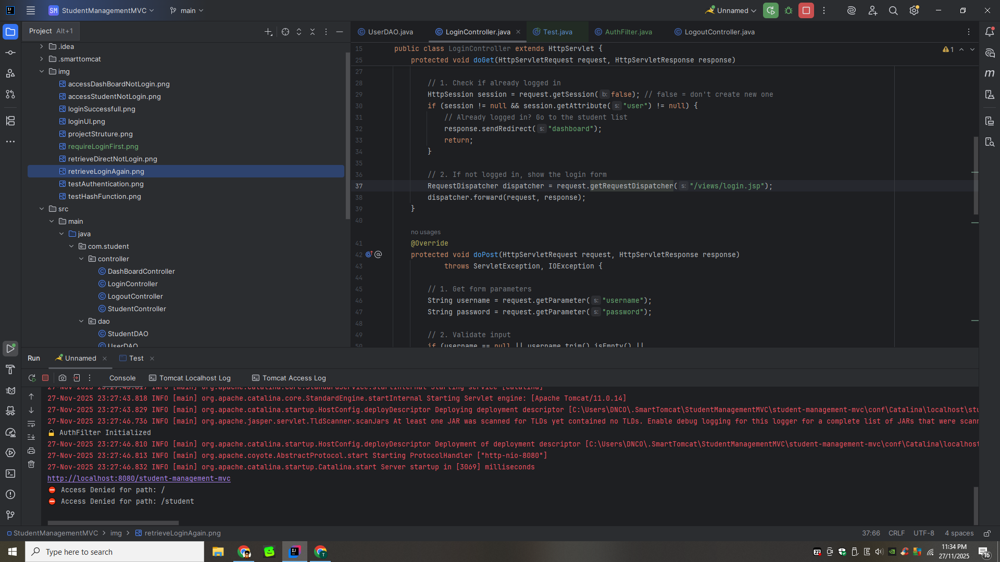
- Try accessing /student without login → Should redirect to login
- And terminal present denies for the path only user can access

#### After
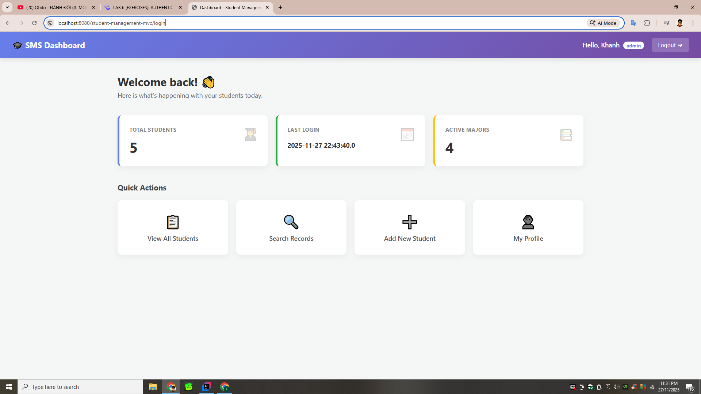


### Access static files (CSS, images) → Should work without login
#### The folder hold the img that public user can access
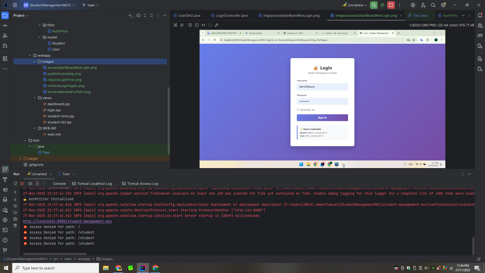
#### Access public img
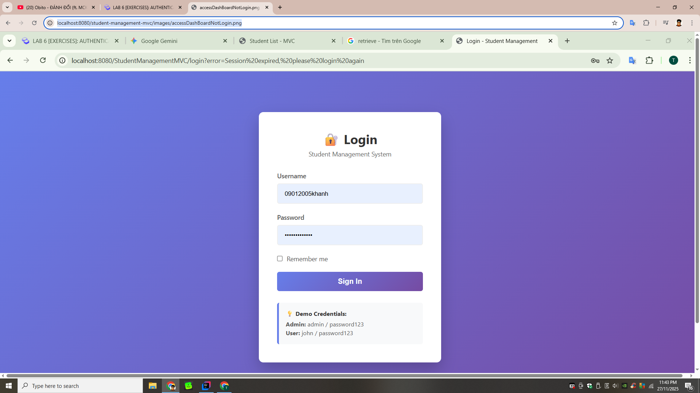

## EXERCISE 6: ADMIN AUTHORIZATION FILTER (10 points)
### Code Explain
```
if (isAdminAction(action)) {

    // 3. Get session and user
    HttpSession session = httpRequest.getSession(false);
    User user = (session != null) ? (User) session.getAttribute("user") : null;

    // 4. Check if user exists AND is an Admin
    // Note: Make sure your User model has .isAdmin() or check .getRole().equals("admin")
    if (user != null && "admin".equalsIgnoreCase(user.getRole())) {
        // ✅ ACCESS GRANTED
        chain.doFilter(request, response);
    } else {
        // ⛔ ACCESS DENIED
        System.out.println("⛔ Non-admin tried to access: " + action);
        // Redirect back to the list with an error message
        httpResponse.sendRedirect(httpRequest.getContextPath() + "/student?action=list&error=Access Denied: Admin privileges required.");
    }
} else {
    // 5. It is a public action (list, search, filter, sort)
    // Allow everyone (even normal users) to pass
    chain.doFilter(request, response);
}
```
- Check all the endpoints is that action belong to admin or not
- Else not in admin action it is public action allow normal user
- Then go through the if statement if user role is admin can access that action
- chain.doFilter(request, response) : "I have finished my work (checking logic, logging, security). This request is safe. Please pass it to the next person in line."

### Login as admin → Try edit/delete → Should work

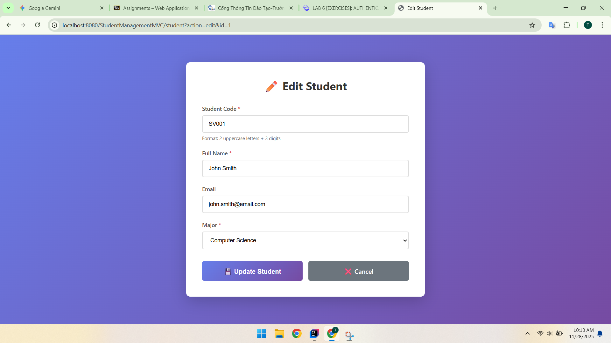

### Logout. Login as regular user → Try edit/delete → Should be blocked

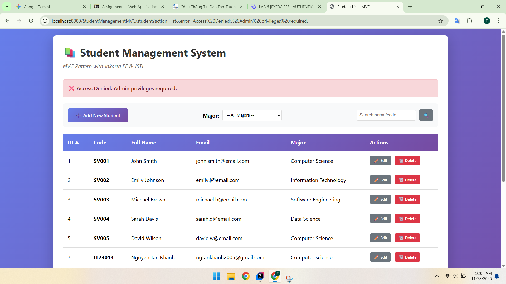

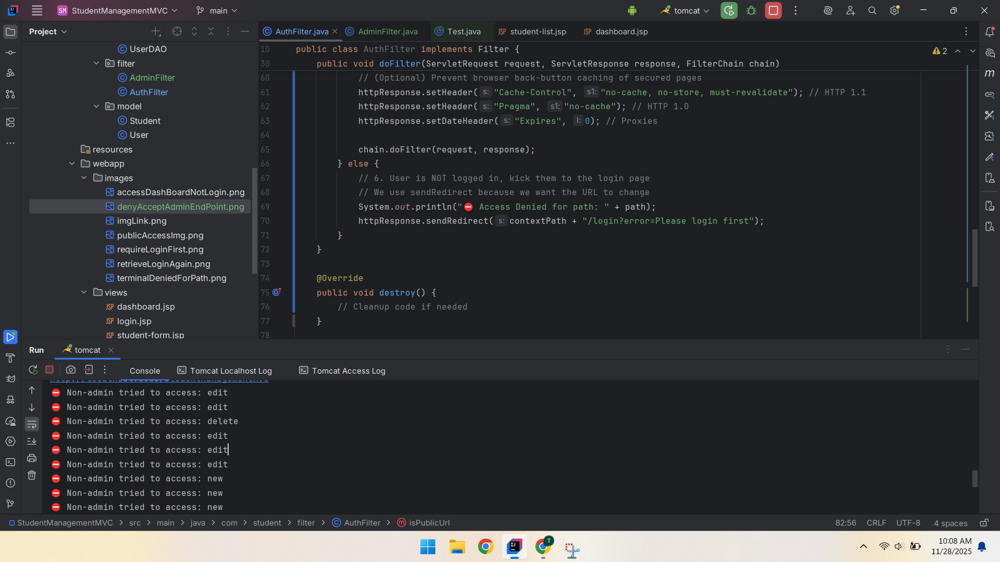

### Try direct URL: /student?action=delete&id=1 → Should be blocked

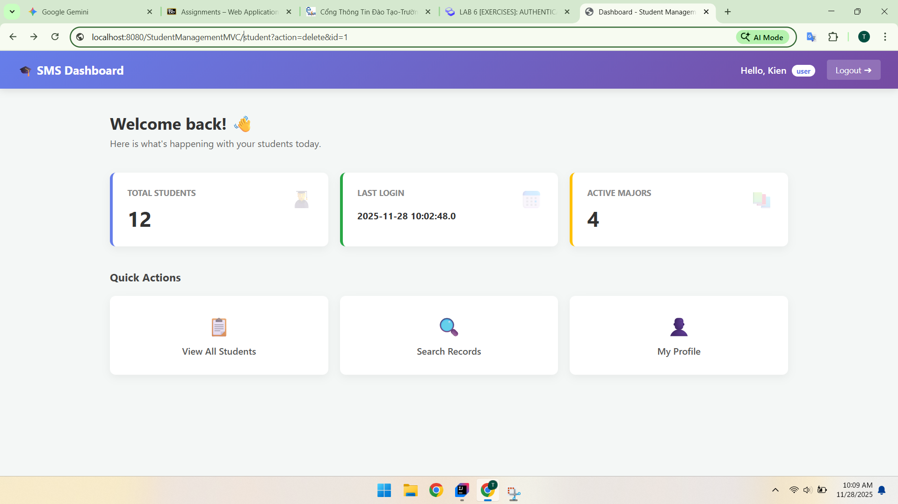

## EXERCISE 7: ROLE-BASED UI (10 points)

### User UI

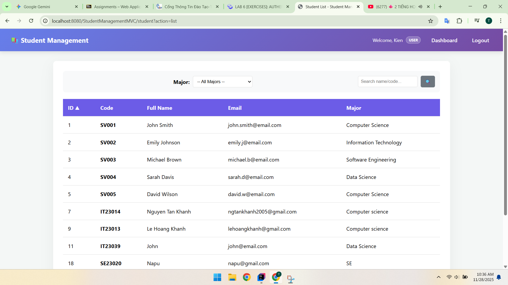

### Admin UI

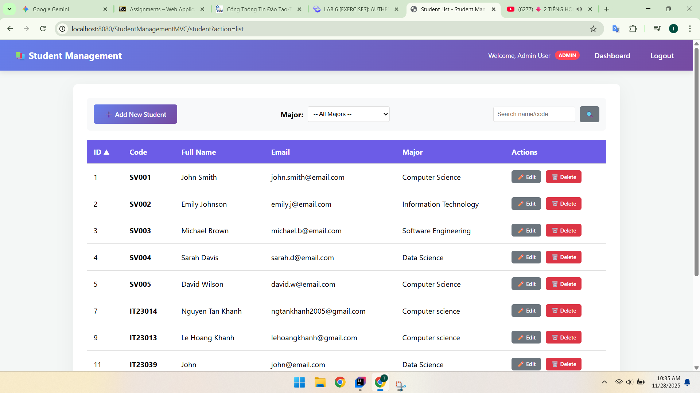

## EXERCISE 8: CHANGE PASSWORD (8 points) - Optional

### Change Password UI

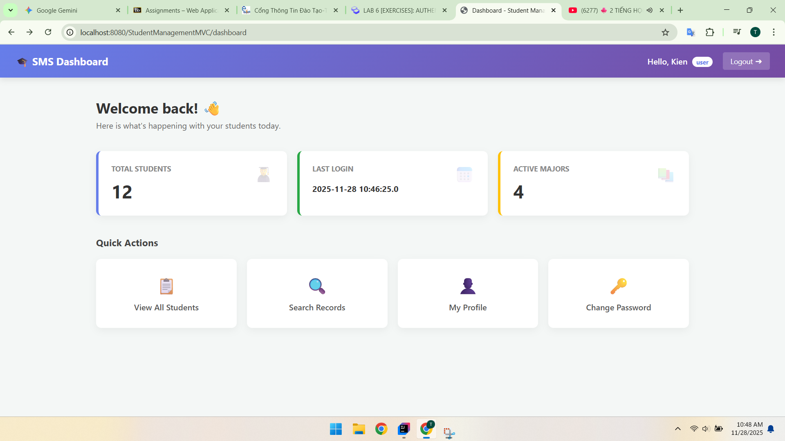

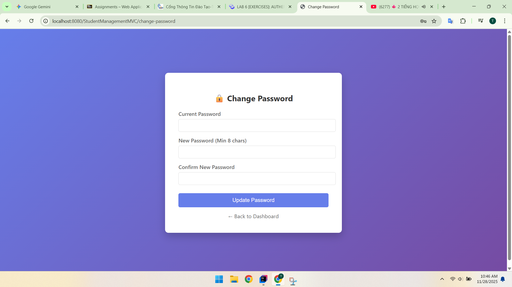

### Change Password Successfully

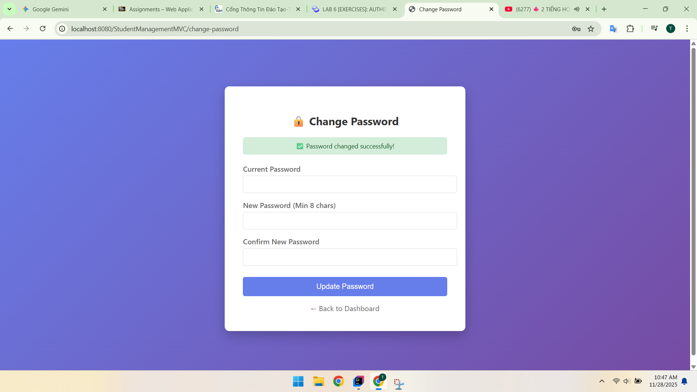


