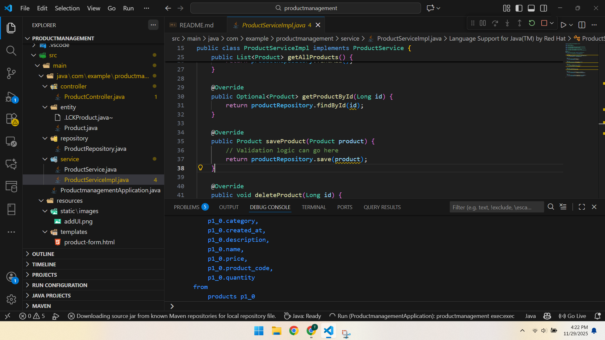
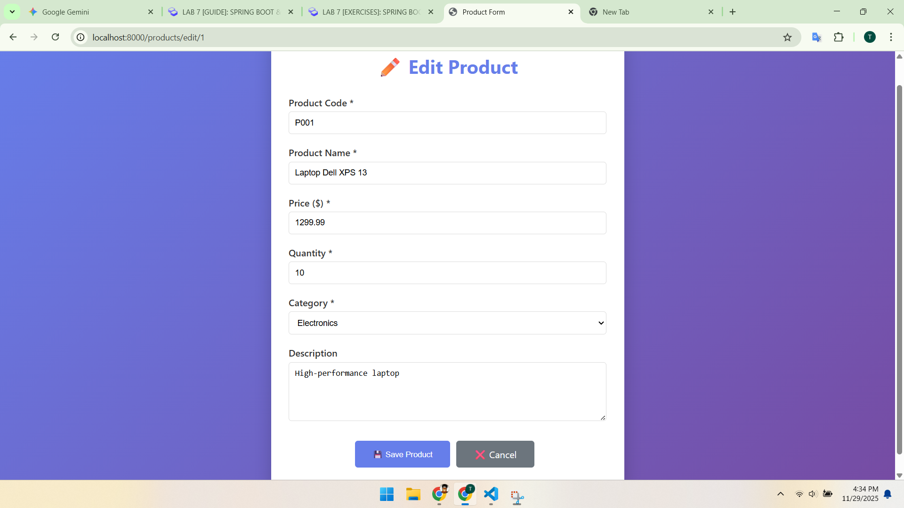
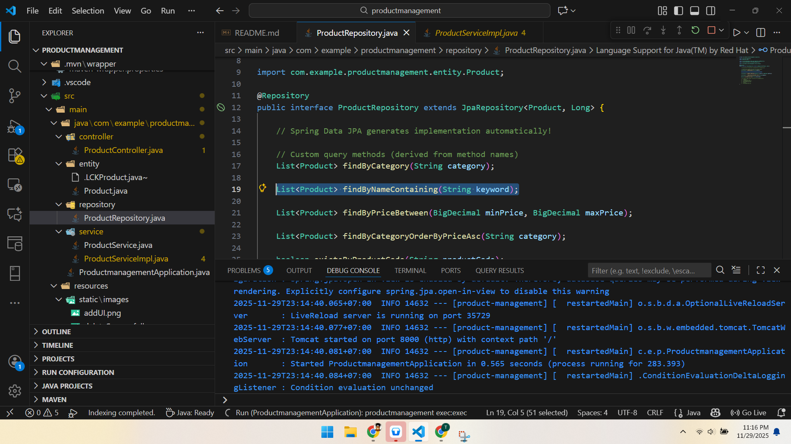
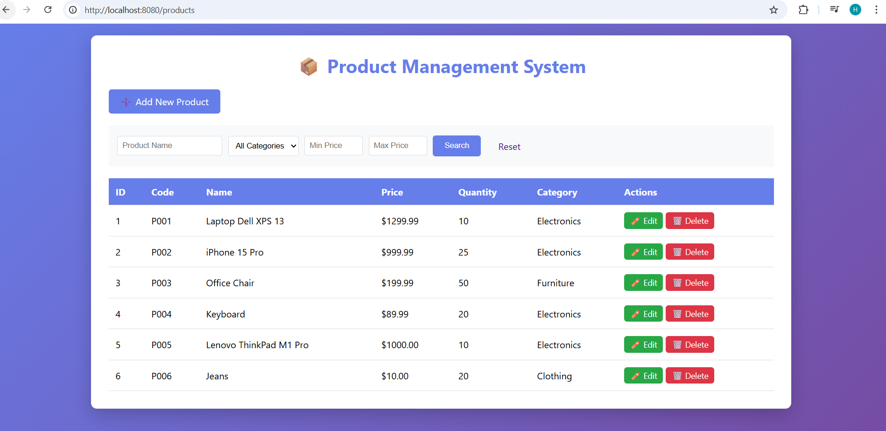
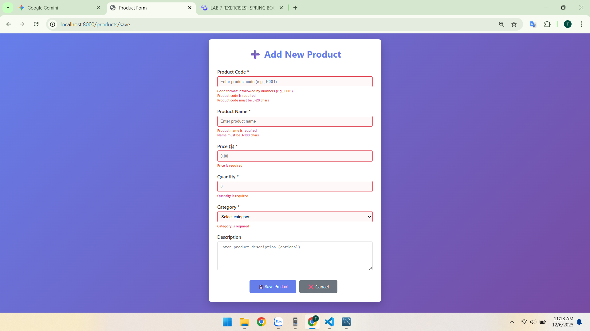
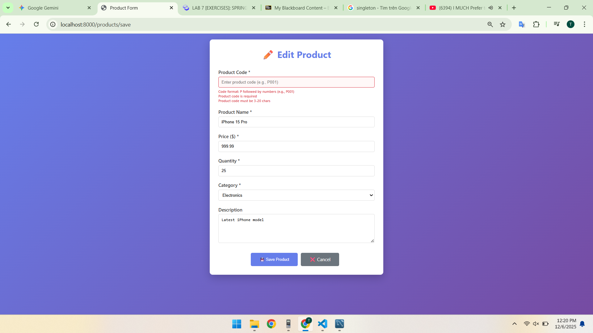
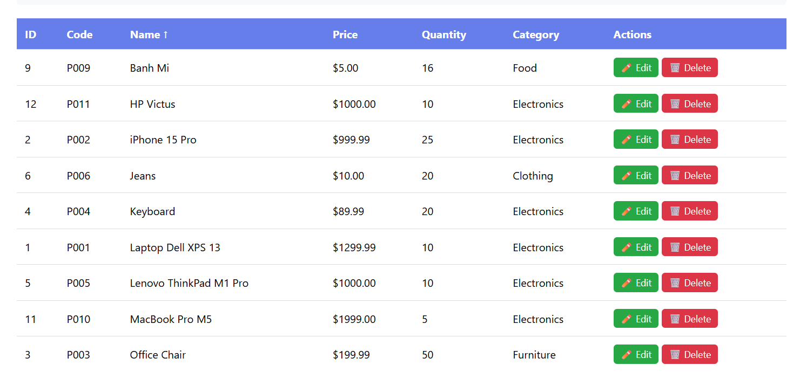
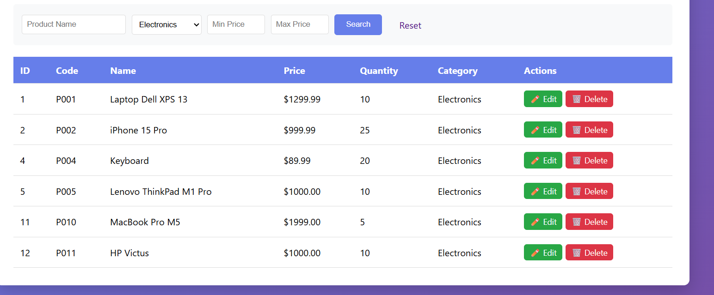
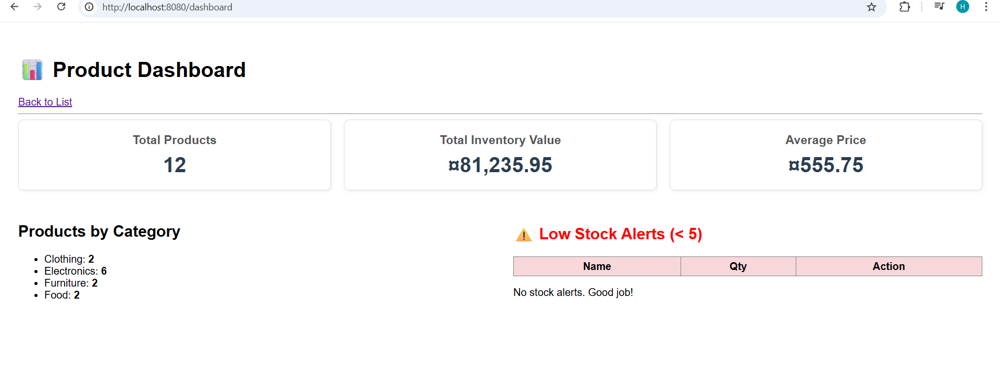

# 🚀 LAB 7 EXERCISES: SPRING BOOT & JPA CRUD
Course: Web Application Development
Name: Nguyen Tan Khanh
ID: ITCSIU23014
Tutor: Nguyen Trung Nghia

# PART A: IN-CLASS EXERCISES (60 points)

## Create function
```html
<!-- Actions -->
<div class="actions">
    <a th:href="@{/products/new}" class="btn btn-primary">➕ Add New Product</a>
    
    <form th:action="@{/products/search}" method="get" class="search-form">
        <input type="text" name="keyword" th:value="${keyword}" placeholder="Search products..." />
        <button type="submit" class="btn btn-primary">🔍 Search</button>
    </form>
</div>
```
* when user click on `add new product button` will access call the get method through "a tag"
```java
// Show form for new product
@GetMapping("/new")
public String showNewForm(Model model) {
    Product product = new Product();
    model.addAttribute("product", product);
    return "product-    form";
}
```
* Then the endpoints is new so it do the get method @GetMapping("/new")
* Add new product so it create new object Product then the respones bring the object to product-form
* The product-form.html generate the ui with data and response to client
### User view


### Click on add btn in form

```html
<h1 th:text="${product.id != null} ? '✏️ Edit Product' : '➕ Add New Product'">Product Form</h1>
<form th:action="@{/products/save}" th:object="${product}" method="post">
```
* The first line is UI seperated if the add product id will empty and if edit product id will has value
* The action post will call 

```java
// Save product (create or update)
@PostMapping("/save")
public String saveProduct(@ModelAttribute("product") Product product, RedirectAttributes redirectAttributes) {
    try {
        productService.saveProduct(product);
        redirectAttributes.addFlashAttribute("message", 
                product.getId() == null ? "Product added successfully!" : "Product updated successfully!");
    } catch (Exception e) {
        redirectAttributes.addFlashAttribute("error", "Error saving product: " + e.getMessage());
    }
    return "redirect:/products";
}
```
* productService is object of a class interface
* Controller doesn't care how the service works, only that it follows the rules defined in the interface.




## update and delete
### Explaination
* The same with add
### Demo
#### Edit UI

#### Delete UI

#### Delete Successful UI


## Search method
```html
<form th:action="@{/products/search}" method="get" class="search-form">
    <input type="text" name="keyword" th:value="${keyword}" placeholder="Search products..." />
    <button type="submit" class="btn btn-primary">🔍 Search</button>
</form>
```
* when type on the search bar click search or press enter go to the endpoints search and go to ProductController
```java
// Search products
@GetMapping("/search")
public String searchProducts(@RequestParam("keyword") String keyword, Model model) {
    List<Product> products = productService.searchProducts(keyword);
    model.addAttribute("products", products);
    model.addAttribute("keyword", keyword);
    return "product-list";
}
```
* keyword role is when call ProductController and return the new html file it will remain the keywork of user
* productService is object of a class interface
* Controller doesn't care how the service works, only that it follows the rules defined in the interface.
* Then service will call the repository

* the findByNameContaining is inherited by class JpaRepository


# PART B: HOMEWORK EXERCISES (40 points)

## EXERCISE 5: ADVANCED SEARCH (12 points)

#### Task 5.1: Multi-Criteria Search (6 points)

Add search by multiple criteria:
- Name (contains)
- Category (exact match)
- Price range (min-max)

**Add to ProductRepository:**
```java
@Query("SELECT p FROM Product p WHERE " +
       "(:name IS NULL OR p.name LIKE %:name%) AND " +
       "(:category IS NULL OR p.category = :category) AND " +
       "(:minPrice IS NULL OR p.price >= :minPrice) AND " +
       "(:maxPrice IS NULL OR p.price <= :maxPrice)")
List<Product> searchProducts(@Param("name") String name,
                            @Param("category") String category,
                            @Param("minPrice") BigDecimal minPrice,
                            @Param("maxPrice") BigDecimal maxPrice);
```

**Add to Service interface and implementation.**

**Add to Controller:**
```java
@GetMapping("/advanced-search")
public String advancedSearch(
    @RequestParam(required = false) String name,
    @RequestParam(required = false) String category,
    @RequestParam(required = false) BigDecimal minPrice,
    @RequestParam(required = false) BigDecimal maxPrice,
    Model model) {
    // Implementation

    - Line: 120 - 128
}
```

**Add advanced search form to product-list.html.**


---

#### Task 5.2: Category Filter (3 points)

Add category filter dropdown that shows all unique categories.

**Add to ProductRepository:**
```java
@Query("SELECT DISTINCT p.category FROM Product p ORDER BY p.category")
List<String> findAllCategories();
```

**Add filter dropdown to view:**
```html
<select name="category" onchange="this.form.submit()">
    <option value="">All Categories</option>
    <option th:each="cat : ${categories}" 
            th:value="${cat}" 
            th:text="${cat}"
            th:selected="${cat == selectedCategory}">
    </option>
</select>
```

---

#### Task 5.3: Search with Pagination (3 points)

Implement pagination for search results.

**Modify repository method to use Pageable:**
```java
Page<Product> findByNameContaining(String keyword, Pageable pageable);
```

**Update controller to handle pagination:**
```java
@GetMapping("/search")
public String searchProducts(
    @RequestParam("keyword") String keyword,
    @RequestParam(defaultValue = "0") int page,
    @RequestParam(defaultValue = "10") int size,
    Model model) {
    
    Pageable pageable = PageRequest.of(page, size);
    Page<Product> productPage = productService.searchProducts(keyword, pageable);
    
    model.addAttribute("products", productPage.getContent());
    model.addAttribute("currentPage", page);
    model.addAttribute("totalPages", productPage.getTotalPages());
    
    return "product-list";
}
```

---
## EXERCISE 6: VALIDATION (10 points)

```java
@NotBlank(message = "Product code is required")
@Size(min = 3, max = 20, message = "Product code must be 3-20 chars")
@Pattern(regexp = "^P\\d{3,}$", message = "Code format: P followed by numbers (e.g., P001)")
@Column(unique = true, nullable = false)
private String productCode;

@NotBlank(message = "Product name is required")
@Size(min = 3, max = 100, message = "Name must be 3-100 chars")
private String name;

//Price and so on
......
......
```
- The Product Code must be not blank, 3  < size < 20 , format P001 , unique and not nullable

``` java
// Save product (create or update)
@PostMapping("/save")
public String saveProduct(
        @Valid @ModelAttribute("product") Product product, // 1. Trigger Validation
        BindingResult result,                              // 2. Capture Errors
        Model model,
        RedirectAttributes redirectAttributes) {

    // 3. Check for errors
    if (result.hasErrors()) {
        // Validation failed: Go back to the form so user can see error messages
        // Do NOT redirect here, or you lose the error data
        return "product-form"; 
    }

    try {
        productService.saveProduct(product);
        redirectAttributes.addFlashAttribute("message", 
            product.getId() == null ? "Product added successfully!" : "Product updated successfully!");
    } catch (Exception e) {
        redirectAttributes.addFlashAttribute("error", "Error saving product: " + e.getMessage());
        return "redirect:/products";
    }

    return "redirect:/products";
}
```
- @ModelAttribute("product") Product product: Mapping the product java object 
- @Valid This is the trigger. It tells Spring: "Before you run any code inside this method, look at the annotations in the Product class (@NotBlank, @Min, etc.) 
- BindingResult: This object holds the report card of the validation.
- Model: This is used to send data back to the HTML page if validation fails (though Spring does this automatically for the product object).
- Why not redirect? If we redirect, the browser refreshes, and all the error messages (and the data the user typed) are lost. By returning the view name directly, Spring keeps the data so the user can fix their mistakes.
- return "redirect:/products": This uses the Post-Redirect-Get (PRG) pattern.
- So it need to call get method again load all the product into list-product
```html
<div class="form-group">
    <label for="productCode">Product Code <span style="color:red">*</span></label>
    <input type="text" 
            id="productCode" 
            th:field="*{productCode}" 
            placeholder="e.g., P001"
            th:classappend="${#fields.hasErrors('productCode')} ? 'input-error' : ''" 
            required />
    <span th:if="${#fields.hasErrors('productCode')}" 
            th:errors="*{productCode}" 
            class="error-msg"></span>
</div>
```
-

## Results



### EXERCISE 7: SORTING & FILTERING (10 points)

**Estimated Time:** 40 minutes

#### Task 7.1: Add Sorting (5 points)

**Update controller:**
```java
@GetMapping
public String listProducts(
    @RequestParam(required = false) String sortBy,
    @RequestParam(defaultValue = "asc") String sortDir,
    Model model) {
    
    List<Product> products;
    
    if (sortBy != null) {
        Sort sort = sortDir.equals("asc") ? 
            Sort.by(sortBy).ascending() : 
            Sort.by(sortBy).descending();
        products = productService.getAllProducts(sort);
    } else {
        products = productService.getAllProducts();
    }
    
    model.addAttribute("products", products);
    model.addAttribute("sortBy", sortBy);
    model.addAttribute("sortDir", sortDir);
    
    return "product-list";
}
```

**Update service to accept Sort parameter.**

**Add sorting links to view:**
```html
<th>
    <a th:href="@{/products(sortBy='name',sortDir=${sortDir=='asc'?'desc':'asc'})}">
        Name
        <span th:if="${sortBy=='name'}" th:text="${sortDir=='asc'?'↑':'↓'}"></span>
    </a>
</th>
```

- Result: Filter by Name
    
---

#### Task 7.2: Filter by Category (3 points)

Add category filter buttons/dropdown that maintains sorting.

- Result: 
    
---

#### Task 7.3: Combined Sorting and Filtering (2 points)

Combine sorting and filtering in one interface.

---

### EXERCISE 8: STATISTICS DASHBOARD (8 points)

**Estimated Time:** 35 minutes

Create a dashboard showing statistics.

#### Task 8.1: Add Statistics Methods (4 points)

**Add to ProductRepository:**
```java
@Query("SELECT COUNT(p) FROM Product p WHERE p.category = :category")
long countByCategory(@Param("category") String category);

@Query("SELECT SUM(p.price * p.quantity) FROM Product p")
BigDecimal calculateTotalValue();

@Query("SELECT AVG(p.price) FROM Product p")
BigDecimal calculateAveragePrice();

@Query("SELECT p FROM Product p WHERE p.quantity < :threshold")
List<Product> findLowStockProducts(@Param("threshold") int threshold);
```

---

#### Task 8.2: Create Dashboard Controller (2 points)

```java
@Controller
@RequestMapping("/dashboard")
public class DashboardController {
    
    @Autowired
    private ProductService productService;
    
    @GetMapping
    public String showDashboard(Model model) {
        // Add statistics to model
        return "dashboard";
    }
}
```

---

#### Task 8.3: Create Dashboard View (2 points)

**Create:** `src/main/resources/templates/dashboard.html`

Display:
- Total products count
- Products by category (pie chart or list)
- Total inventory value
- Average product price
- Low stock alerts (quantity < 10)
- Recent products (last 5 added)

Result:
    


