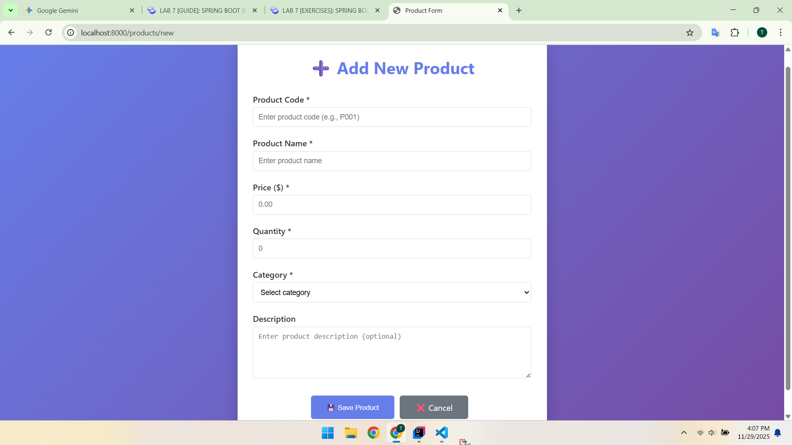
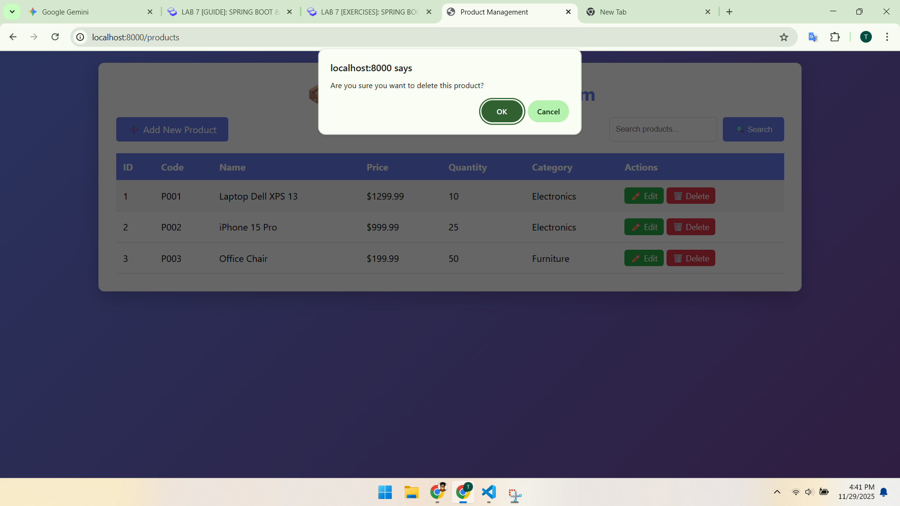
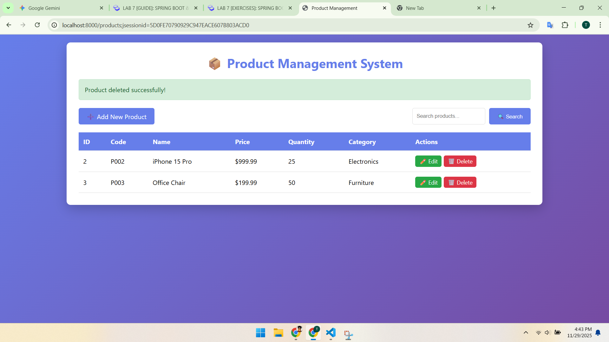

# 🚀 LAB 7 EXERCISES: SPRING BOOT & JPA CRUD
Course: Web Application Development
Name: Nguyen Tan Khanh
ID: ITCSIU23014
Tutor: Nguyen Trung Nghia

# PART A: IN-CLASS EXERCISES (60 points)

## Create function
```html
<!-- Actions -->
<div class="actions">
    <a th:href="@{/products/new}" class="btn btn-primary">➕ Add New Product</a>
    
    <form th:action="@{/products/search}" method="get" class="search-form">
        <input type="text" name="keyword" th:value="${keyword}" placeholder="Search products..." />
        <button type="submit" class="btn btn-primary">🔍 Search</button>
    </form>
</div>
```
* when user click on `add new product button` will access call the get method through "a tag"
```java
// Show form for new product
@GetMapping("/new")
public String showNewForm(Model model) {
    Product product = new Product();
    model.addAttribute("product", product);
    return "product-    form";
}
```
* Then the endpoints is new so it do the get method @GetMapping("/new")
* Add new product so it create new object Product then the respones bring the object to product-form
* The product-form.html generate the ui with data and response to client
### User view


### Click on add btn in form

```html
<h1 th:text="${product.id != null} ? '✏️ Edit Product' : '➕ Add New Product'">Product Form</h1>
<form th:action="@{/products/save}" th:object="${product}" method="post">
```
* The first line is UI seperated if the add product id will empty and if edit product id will has value
* The action post will call 

```java
// Save product (create or update)
@PostMapping("/save")
public String saveProduct(@ModelAttribute("product") Product product, RedirectAttributes redirectAttributes) {
    try {
        productService.saveProduct(product);
        redirectAttributes.addFlashAttribute("message", 
                product.getId() == null ? "Product added successfully!" : "Product updated successfully!");
    } catch (Exception e) {
        redirectAttributes.addFlashAttribute("error", "Error saving product: " + e.getMessage());
    }
    return "redirect:/products";
}
```
* productService is object of a class interface
* Controller doesn't care how the service works, only that it follows the rules defined in the interface.


## update and delete
### Explaination
* The same with add
### Demo
#### Edit UI

#### Delete UI

#### Delete Successful UI


## Search method
```html
<form th:action="@{/products/search}" method="get" class="search-form">
    <input type="text" name="keyword" th:value="${keyword}" placeholder="Search products..." />
    <button type="submit" class="btn btn-primary">🔍 Search</button>
</form>
```
* when type on the search bar click search or press enter go to the endpoints search and go to ProductController
```java
// Search products
@GetMapping("/search")
public String searchProducts(@RequestParam("keyword") String keyword, Model model) {
    List<Product> products = productService.searchProducts(keyword);
    model.addAttribute("products", products);
    model.addAttribute("keyword", keyword);
    return "product-list";
}
```
* keyword role is when call ProductController and return the new html file it will remain the keywork of user
* productService is object of a class interface
* Controller doesn't care how the service works, only that it follows the rules defined in the interface.
* Then service will call the repository

* the findByNameContaining is inherited by class JpaRepository

