# 🚀 LAB 8 EXERCISES: REST API & DTO PATTERN
Course: Web Application Development
Name: Nguyen Tan Khanh
ID: ITCSIU23014
Tutor: Nguyen Trung Nghia

## PART A: IN-CLASS EXERCISES (60 points)

### GET all customers - 200 OK
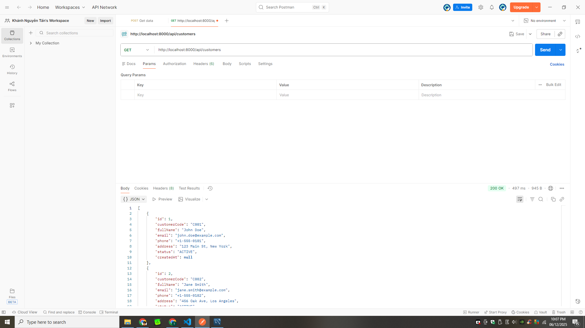

#### GET by ID - 200 OK
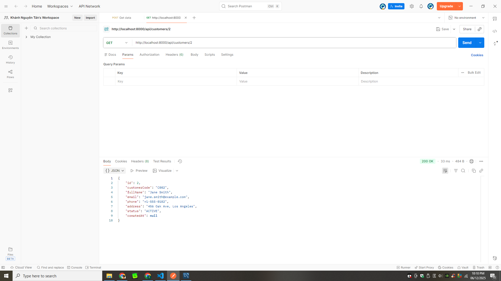

#### POST create - 201 Created


#### PUT update - 200 OK
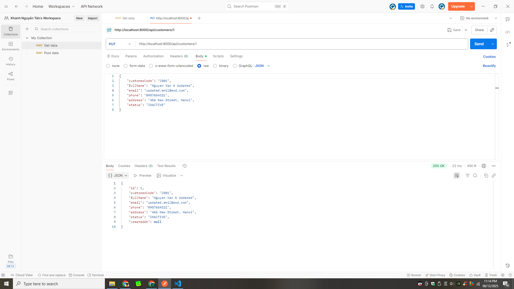

#### DELETE - 200 OK
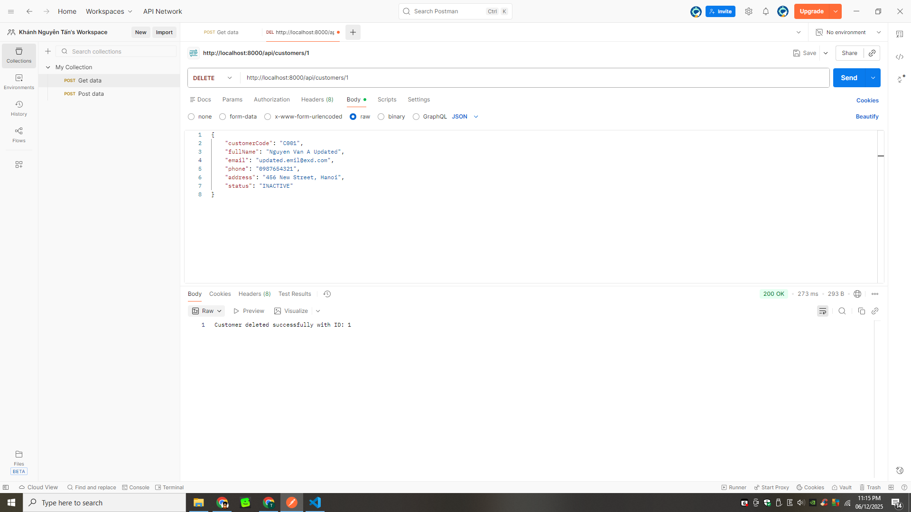

#### Validation error - 400 Bad Request
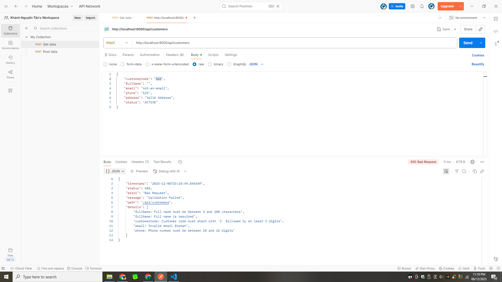

Not found error - 404
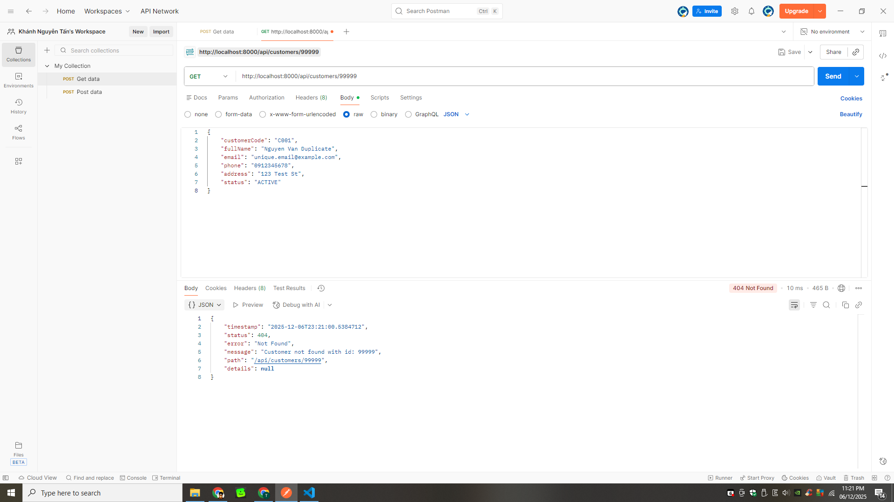

Duplicate error - 409 Conflict
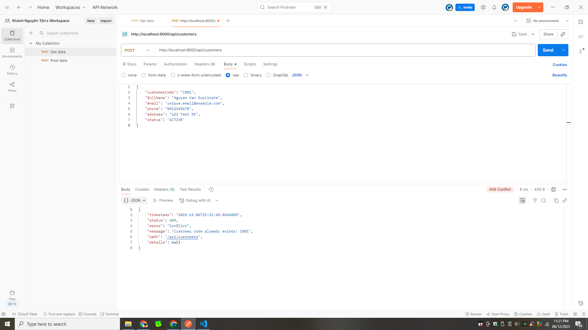

## PART B: HOMEWORK EXERCISES (40 points)


### EXERCISE 5: SEARCH & FILTER ENDPOINTS (12 points)

#### Search 
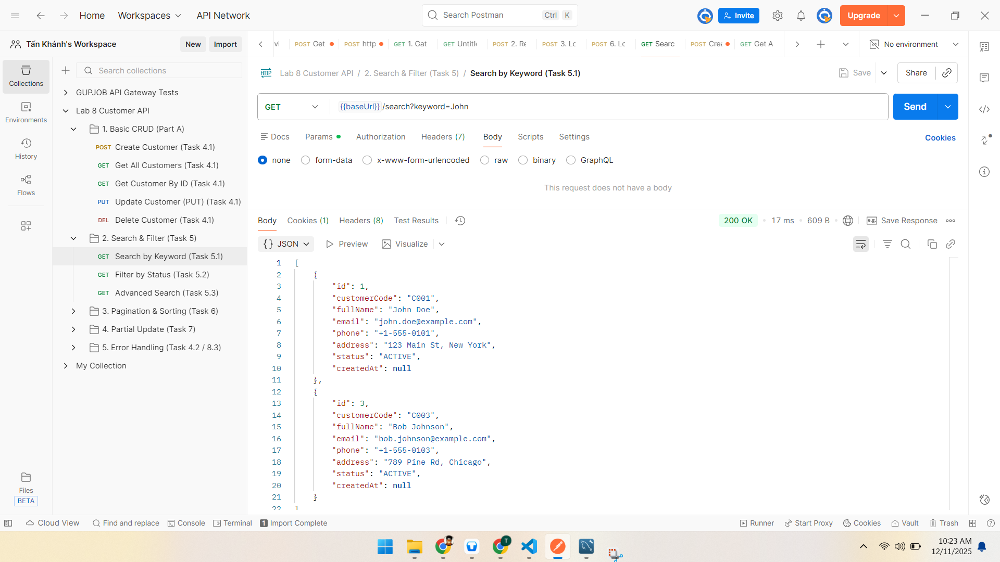

#### Filter by status

- Add this code to repository to query customer by status
```java
//Search customer by status
    @Query("SELECT c FROM Customer c WHERE c.status = :status")
    List<Customer> findAllByStatus(String status);
```
- Then add getCustomersByStatus service and mapping into ResponseDTO
```java
@Override
public List<CustomerResponseDTO> getCustomersByStatus(String status) {
    return customerRepository.findAllByStatus(status)
            .stream()
            .map(this::convertToResponseDTO)
            .collect(Collectors.toList());
}
```
##### Result
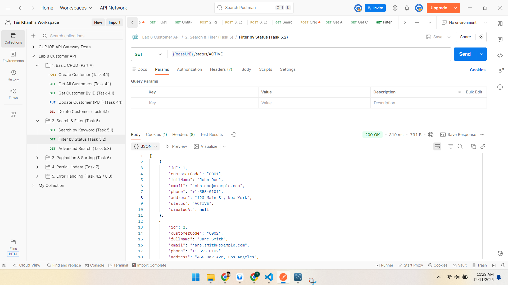

#### Advance search

- Implement the service convert status to enum string
- Find all the valid entity
- Convert to dto response
```java
@Override
public List<CustomerResponseDTO> advancedSearch(String name, String email, String statusStr)
{
    CustomerStatus status = null;
    if (statusStr != null && !statusStr.isEmpty()) {
        try {
            status = CustomerStatus.valueOf(statusStr.toUpperCase());
        } catch (IllegalArgumentException e) {
            throw new ResourceNotFoundException("Invalid status: " + statusStr);
        }
    }

    List<Customer> customers = customerRepository
            .findByFullNameContainingIgnoreCaseAndEmailContainingIgnoreCaseAndStatus(
                    name != null ? name : "",
                    email != null ? email : "",
                    status);

    return customers.stream()
            .map(this::convertToResponseDTO)
            .collect(Collectors.toList());
}
```
##### Result
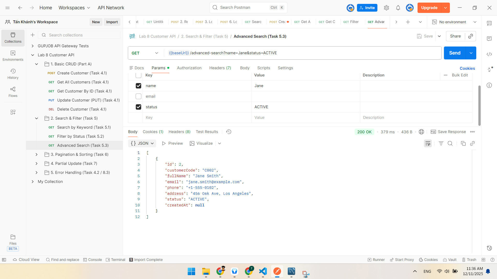


### EXERCISE 6: PAGINATION & SORTING (10 points)

#### Task 6.1: Add Pagination (5 points)

- Update get all customer with pagination
- ' response.put("customers", customerPage.getContent())' page property and push to html can use
```java
// 1. GET ALL CUSTOMERS with Pagination
@GetMapping
public ResponseEntity<Map<String, Object>> getAllCustomers(
        @RequestParam(defaultValue = "0") int page,
        @RequestParam(defaultValue = "3") int size) {
    
    Page<CustomerResponseDTO> customerPage = customerService.getAllCustomers(page, size);
    
    Map<String, Object> response = new HashMap<>();
    response.put("customers", customerPage.getContent());
    response.put("currentPage", customerPage.getNumber());
    response.put("totalItems", customerPage.getTotalElements());
    response.put("totalPages", customerPage.getTotalPages());
    
    return ResponseEntity.ok(response);
}
```
- Add service implement 
- findAll(pageable) is inherit from JpaRepository<Customer, Long>
- Inside that is using page and size to calculate the query offset
- If page is 1 and size is 2
```sql
SELECT * FROM customers 
ORDER BY id ASC  -- Always good to have an order for consistent pagination
LIMIT 2         -- The 'size'
OFFSET 2;       -- The calculated (page * size)
```
- It mean discard first 2 customer and get 2 next customer
```java
@Override
public Page<CustomerResponseDTO> getAllCustomers(int page, int size) {
    // 1. Create Pageable object (Page 0 = First Page)
    Pageable pageable = PageRequest.of(page, size);
    
    // 2. Fetch Page<Customer> from Repository
    Page<Customer> customerPage = customerRepository.findAll(pageable);
    
    // 3. Convert Page<Customer> -> Page<CustomerResponseDTO>
    // The .map() function automatically handles the conversion for every item in the page
    return customerPage.map(this::convertToResponseDTO);
}
```

##### Page 0
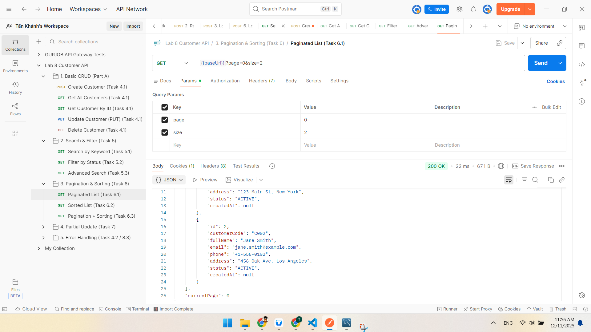
##### Page 1


#### Task 6.2 Combine 

- Create sort object for sorting if the sortDir parameter is desc sort the sortBy parameter by descrese otherwise increase
- Pageable the same above
- If one parameter missing missing it set to default which set up in controller
- So we can do http://localhost:8000/api/customers?sortBy=fullName&sortDir=desc and http://localhost:8000?page=1&size=2
```java
// Pagination 
@Override
public Page<CustomerResponseDTO> getAllCustomers(int page, int size, String sortBy, String sortDir) {
    
    // 1. Configure Sorting
    // Check if sort direction is "desc", otherwise default to "asc"
    Sort sort = sortDir.equalsIgnoreCase(Sort.Direction.DESC.name()) 
            ? Sort.by(sortBy).descending() 
            : Sort.by(sortBy).ascending();

    // 2. Create Pageable object with Page, Size, AND Sort
    Pageable pageable = PageRequest.of(page, size, sort);
    
    // 3. Fetch data
    return customerRepository.findAll(pageable)
            .map(this::convertToResponseDTO);
}
```
##### Result
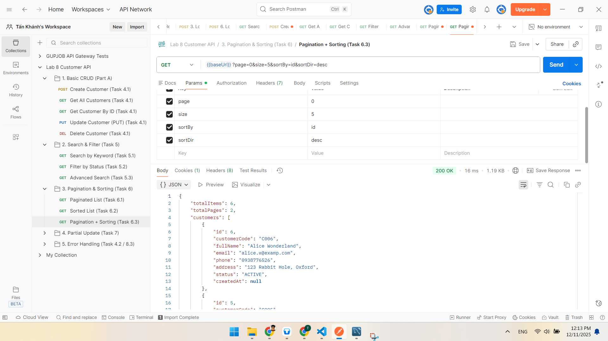

#### EXERCISE 7: PARTIAL UPDATE WITH PATCH

- Update DTO for user input and has the constrain
```java
@Data
public class CustomerUpdateDTO {

    @NotBlank(message = "Full name is required")
    @Size(min = 2, max = 100, message = "Full name must be between 2 and 100 characters")
    private String fullName;

    @NotBlank(message = "Email is required")
    @Pattern(regexp = "^[A-Za-z0-9+_.-]+@[A-Za-z0-9.-]+$", message = "Invalid email format") 
    private String email;

    @NotBlank(message = "Phone number is required")
    private String phone;

    @Size(max = 500, message = "Address cannot exceed 500 characters")
    private String address;

    // This is the Perfect Strategy: Validate String here -> Convert to Enum in Service
    @Pattern(regexp = "^(ACTIVE|INACTIVE|BANNED|PENDING)$", message = "Status must be ACTIVE, INACTIVE, BANNED, or PENDING")
    private String status;
}
```
- Only update the not null fields whichs mean update the fields user requires
- Check the email for exist
```java
@Override
public CustomerResponseDTO partialUpdateCustomer(Long id, CustomerUpdateDTO updateDTO) {
    // 1. Find existing customer
    Customer existingCustomer = customerRepository.findById(id)
            .orElseThrow(() -> new ResourceNotFoundException("Customer not found with id: " + id));

    // 2. Update only non-null fields
    if (updateDTO.getFullName() != null) {
        existingCustomer.setFullName(updateDTO.getFullName());
    }
    if (updateDTO.getEmail() != null) {
        // Check for duplicate email
        if (!existingCustomer.getEmail().equals(updateDTO.getEmail()) && 
                customerRepository.existsByEmail(updateDTO.getEmail())) {
            throw new DuplicateResourceException("Email already taken by another customer");
        }
        existingCustomer.setEmail(updateDTO.getEmail());
    }
    if (updateDTO.getPhone() != null) {
        existingCustomer.setPhone(updateDTO.getPhone());
    }
    if (updateDTO.getAddress() != null) {
        existingCustomer.setAddress(updateDTO.getAddress());
    }
    if (updateDTO.getStatus() != null) {
        existingCustomer.setStatus(CustomerStatus.valueOf(updateDTO.getStatus()));
    }

    // 3. Save and return
    Customer updatedCustomer = customerRepository.save(existingCustomer);
    return convertToResponseDTO(updatedCustomer);
}
```

##### Results

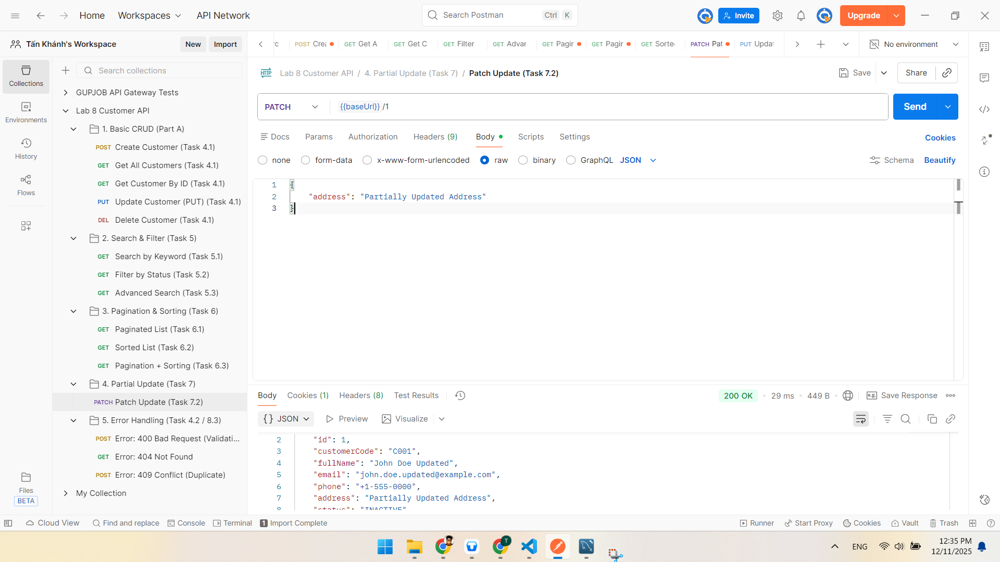

#### EXERCISE 8: API DOCUMENTATION (8 points)

##### Customer_API.postman_collection.js
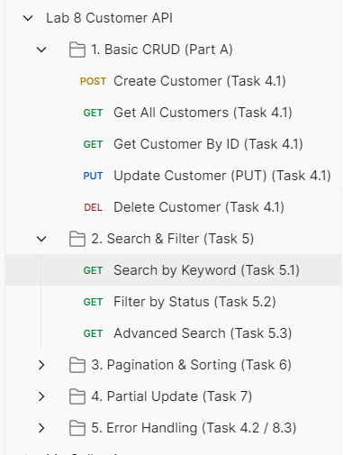

* [Link test file](src/main/resources/static/test/test.js)

##### API_DOCUMENTATION.md

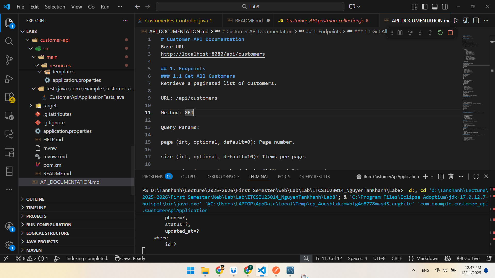


#### BONUS 1: API Versioning (6 points)
- In the real world when we create new version if dont have the dependency injective we need to fix all the code from top down. So now create a new version create new version controller the frontend does care about controller do it just need getAllCustomers() and sringBoot will support which version has getAllCustomers adapt to frontend need like capitalize all the name
##### Version 1
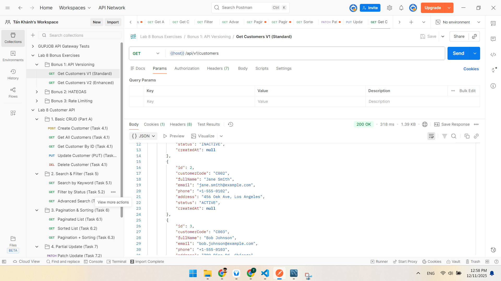
##### Version 2
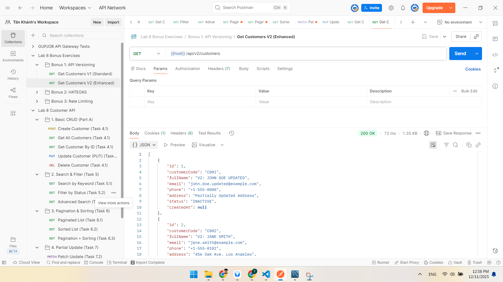


#### Dependency Injection

* Summary
+ Controller: "I need someone who can getAllCustomers()."

+ Spring Boot: "Okay, here is the latest version (V2) that does that."

+ You: Saved hours of work because you didn't have to rewrite the Controller.

#### BONUS 2: HATEOAS Links (7 points)
- Add HATEOAS Links object
```java
@Data
@EqualsAndHashCode(callSuper = false) // <--- Add this
public class CustomerResponseDTO extends RepresentationModel<CustomerResponseDTO> { // <--- Extend this
    private Long id;
    private String customerCode;
    private String fullName;
    private String email;
    private String phone;
    private String address;
    private String status;
}
```

- So in the response extend and inherit the method from their parent and link return the response link to itself or getAllCustomer link get method

```java
// 2. GET CUSTOMER BY ID
@GetMapping("/{id}")
public ResponseEntity<CustomerResponseDTO> getCustomerById(@PathVariable Long id) {
    CustomerResponseDTO customer = customerService.getCustomerById(id);

    // 1. Add "self" link (The URL to THIS specific customer)
    customer.add(linkTo(methodOn(CustomerRestControllerV1.class).getCustomerById(id)).withSelfRel());

    // 2. Add "all-customers" link (The URL to go back to the list)
    customer.add(linkTo(methodOn(CustomerRestControllerV1.class).getAllCustomers(0, 10, "id", "asc")).withRel("all-customers"));

    return ResponseEntity.ok(customer);
}
```

##### Results

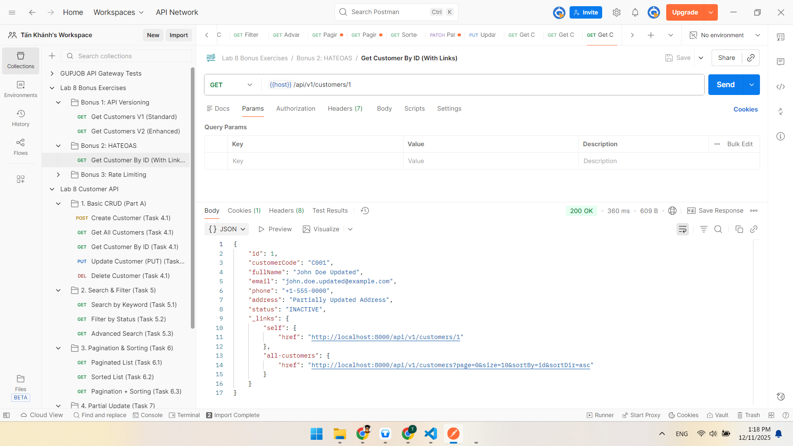
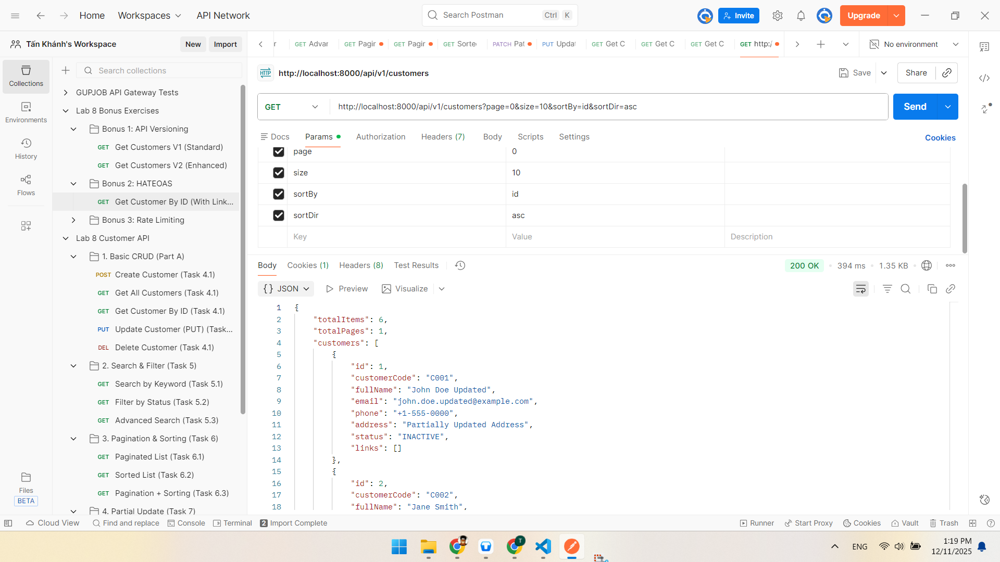

#### BONUS 3: Rate Limiting (7 points)
- In the practice, some bad people try to attack our project by send thousand or million request to our project, so i cause lose resourse( ram, memory) of out server causing crash. So to handle that we need the restrict request per user
- add libary bucket4j to handle this extend from class HandlerInterceptor
- cache is a dictionary to identify by IP address. Each ip address will provide a bucket of 100 request
- Each one minutes it can refill 100 tokens 
```java
private final Map<String, Bucket> cache = new ConcurrentHashMap<>();

@Override
public boolean preHandle(HttpServletRequest request, HttpServletResponse response, Object handler) throws Exception {
    String apiKey = request.getRemoteAddr(); // Identify user by IP address
    
    // Get or create a bucket for this IP
    Bucket bucket = cache.computeIfAbsent(apiKey, this::createNewBucket);

    // Try to consume 1 token
    if (bucket.tryConsume(1)) {
        return true; // Success, proceed to Controller
    } else {
        // Fail, return 429 Error
        response.setStatus(429);
        response.getWriter().write("Too many requests - Rate limit exceeded");
        return false; // Block request
    }
}

private Bucket createNewBucket(String key) {
    // Rule: 100 requests allowed per 1 minute
    Bandwidth limit = Bandwidth.classic(100, Refill.greedy(100, Duration.ofMinutes(1)));
    return Bucket.builder().addLimit(limit).build();
}
```
- @Configuration Annotation: This tells Spring Boot: "Hey, this is a settings class. Please read it during startup
- Ignore all the point with differnet end point /api
- And when /api/** endpoint call addInterceptors and add limit request
```java
package com.example.customer_api.config;

import org.springframework.beans.factory.annotation.Autowired;
import org.springframework.context.annotation.Configuration;
import org.springframework.web.servlet.config.annotation.InterceptorRegistry;
import org.springframework.web.servlet.config.annotation.WebMvcConfigurer;

@Configuration
public class WebConfig implements WebMvcConfigurer {

    @Autowired
    private RateLimitInterceptor rateLimitInterceptor;

    @Override
    public void addInterceptors(InterceptorRegistry registry) {
        // This connects your interceptor to the API paths
        registry.addInterceptor(rateLimitInterceptor)
                .addPathPatterns("/api/**"); 
    }
}
```

##### Step interator request postman

##### Result


- We see status 429 in request 119
- Why our bugget is 100 but till 119 the error occur. Because the bugget is refilled 100 per minutes (1.6 token / seconds) so after 12s the token refill is 19.2 that is the reason

